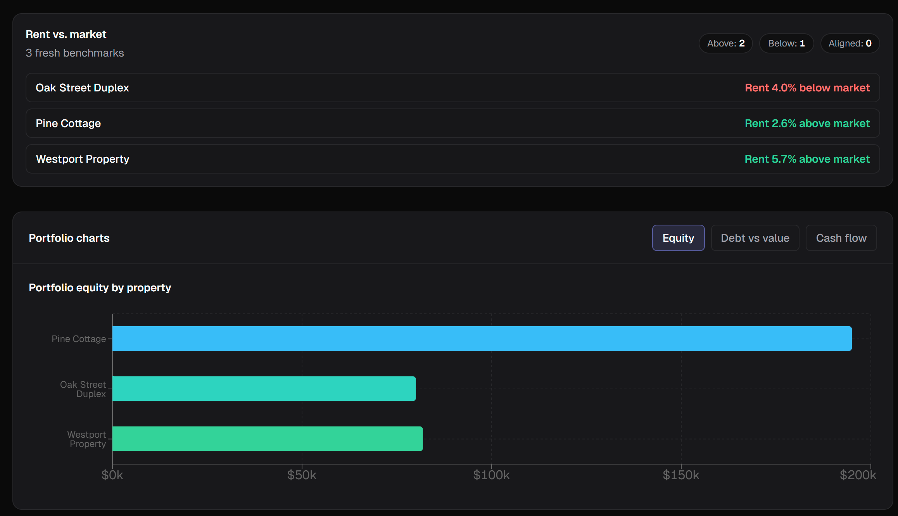
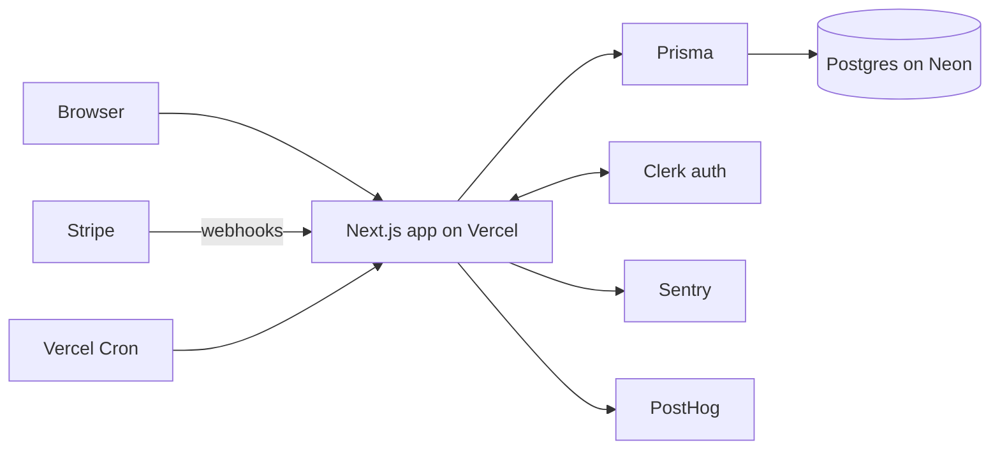
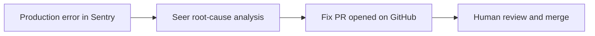

# Veld Portfolio

Real estate investment analytics SaaS for small landlords with 1–20 rental properties.



## Status

Veld is live in production at [veldportfolio.com](https://veldportfolio.com), with about 40 registered users and a first paying customer. It has been in maintenance mode since March 2026.

## What it does

- **Property and mortgage tracking**: properties with ownership share and vacancy, plus multiple mortgages per property. Balances are projected forward from the last known statement date.
- **Analytics suite** (`app/lib/metrics/`, `app/lib/amortization.ts`): NOI, cap rate, cash flow, cash-on-cash return, equity, LTV, and DSCR, along with the rent required to hit a target DSCR. Mortgage math covers amortization schedules, payoff projections with extra payments, refinance projections (monthly savings, interest saved, break-even on closing costs), refi-readiness status, and mortgage milestones. Economic metrics scale by ownership percentage.
- **Insights engine** (`app/lib/insights/`): pure, side-effect-free generators for cash-flow drag, rent opportunity, refi gap, total return, best performer, LTV risk, equity built, and incomplete profile. A picker fills the dashboard slots using a fixed editorial priority within each severity level.
- **CSV import and export** (`app/lib/import/`, `/api/import`, `/api/export`): parsing, validation, and mortgage field checks, with a sample file at `app/sample-import.csv`.
- **Public calculators** (`/tools/*`, `/investment-property-calculator`): BRRRR, cap rate, cash-on-cash, DSCR, fix-and-flip, rent-vs-buy, STR-vs-LTR, and wholesale. They work without an account.
- **Subscription gating** (`app/lib/plans.ts`, Stripe): Free, Investor, and Pro tiers cap properties (1 / 5 / 20), saved deals (5 / 20 / 50), and hourly rent-estimate calls. New users get a 14-day trial with Investor-level access.

## Architecture



Server routes live under `app/app/api/`. Stripe events arrive at `/api/billing/webhook`, and Vercel Cron triggers the monthly data refresh, the digest, and lifecycle emails (`app/vercel.json`). Rent and value estimates come from RentCast.

Design records:

- [docs/decisions/ownership-vacancy-percent-schema.md](docs/decisions/ownership-vacancy-percent-schema.md): whether to move `ownershipPercent` and `vacancyPercent` from `Int` to `Decimal`, and why the schema was left as it is.
- [app/lib/insights/README.md](app/lib/insights/README.md): the insights engine contract, covering purity, editorial priority, and the appreciation-rate tiers.
- [docs/architecture-and-build-practices.md](docs/architecture-and-build-practices.md): layering, validation, and security rules the codebase follows.
- [docs/reference/engineering-spec.md](docs/reference/engineering-spec.md): domain model, API design, and build order.

## How it was built

I built Veld solo with AI-assisted development, using Cursor and Claude Code. I owned the architecture, the data model, every code review, and the financial math. That includes the metric definitions and the golden test cases they are checked against. Agents did most of the typing. Agent roles are defined in [`.cursor/rules/`](.cursor/rules/): a **builder** agent that implements phases, a **PM** agent that gates risk between phases, and a set of audit agents that each review one lane of the codebase:

- **code**, **math**, **feature**, **mobile-experience**
- **security**, **performance-cost**, **reliability-ops**, **data-integrity**
- **business-valuation**, **growth-funnel**, **seo**, **legal-compliance**
- **documentation**, **agent-governance**
- **full-audit**, which runs every lane and writes a synthesis

The process is described in [docs/ai-development-process-extraction.md](docs/ai-development-process-extraction.md), and the Cursor setup in [docs/cursor-agent-setup.md](docs/cursor-agent-setup.md).

## Automated error-to-PR workflow

When an error reaches production, Sentry's Seer Autofix uses the Sentry GitHub integration to find the root cause and open a pull request with a proposed fix. I review that PR and merge it or close it. Seer is a Sentry feature. This repo contains only the Sentry configuration (`app/sentry.server.config.ts`, `app/sentry.edge.config.ts`, `app/instrumentation.ts`), not the agent itself.



## Testing

The suite runs on Vitest with 628 tests in 85 test files under `app/`, mostly covering `lib/` math, API routes, and validation. Financial calculations are checked against hand-computed golden cases in [`app/lib/test/fixtures/metrics-golden.ts`](app/lib/test/fixtures/metrics-golden.ts), and the derivation of each expected value is written out in comments. Changing those numbers is a deliberate act.

```bash
cd app
npm test
```

CI ([`.github/workflows/ci.yml`](.github/workflows/ci.yml)) runs ESLint and the unit tests on pushes to `main` and `develop` and on every pull request. Vercel runs the production build.

## Running locally

```bash
cd app
cp .env.example .env
npm install
npm run dev
```

Then open http://localhost:3000. For full setup and a smoke test, see [docs/setup/run-and-smoke-test.md](docs/setup/run-and-smoke-test.md).

Environment variables (from [`app/.env.example`](app/.env.example)):

| Variable | Purpose |
|---|---|
| `DATABASE_URL` | Postgres connection string (required) |
| `DIRECT_URL` | Direct (non-pooled) Postgres URL that Prisma uses for migrations; referenced in `schema.prisma` |
| `NEXT_PUBLIC_CLERK_PUBLISHABLE_KEY`, `CLERK_SECRET_KEY` | Clerk auth (required) |
| `NEXT_PUBLIC_CLERK_SIGN_IN_FALLBACK_REDIRECT_URL`, `NEXT_PUBLIC_CLERK_SIGN_UP_FALLBACK_REDIRECT_URL` | Post-auth redirect (optional) |
| `NEXT_PUBLIC_CLERK_PRECONNECT_ORIGIN` | Clerk origin for preconnect (optional) |
| `STRIPE_SECRET_KEY`, `NEXT_PUBLIC_STRIPE_PUBLISHABLE_KEY` | Stripe billing (required) |
| `STRIPE_WEBHOOK_SECRET` | Webhook signature verification (required in production) |
| `STRIPE_PRICE_ID_{INVESTOR,PRO}_{MONTHLY,YEARLY}` | Stripe price IDs for each paid plan |
| `NEXT_PUBLIC_PRICE_*` | Displayed prices (optional; defaults in code) |
| `NEXT_PUBLIC_APP_URL` | Canonical origin for redirects, sitemap, robots |
| `CSP_ENFORCEMENT` | Switches CSP from report-only to enforced |
| `RENTCAST_API_KEY` | Rent and value estimates (optional) |
| `GOOGLE_PLACES_API_KEY` | Address autocomplete (optional) |
| `ADMIN_EMAILS` | Comma-separated emails allowed into `/admin` |
| `CRON_SECRET` | Authenticates Vercel Cron requests |
| `UNSUBSCRIBE_HMAC_SECRET` | Signs unsubscribe links (falls back to `CRON_SECRET`) |
| `SUPPORT_EMAIL` | Support contact shown in the app |
| `RESEND_API_KEY`, `RESEND_FROM_DOMAIN` | Transactional and contact-form email |
| `NEXT_PUBLIC_SENTRY_DSN`, `SENTRY_AUTH_TOKEN`, `SENTRY_ORG`, `SENTRY_PROJECT` | Error tracking and source map upload (optional) |
| `NEXT_PUBLIC_POSTHOG_KEY`, `NEXT_PUBLIC_POSTHOG_HOST` | Product analytics (optional) |
| `NEXT_PUBLIC_GOOGLE_ADS_*` | Ads conversion tag and labels (optional) |

## Project structure

```
app/
  app/          Next.js App Router: marketing pages, (app) authenticated routes, api/ handlers
  components/   UI components (dashboard, charts, calculators, property forms, marketing)
  lib/          Domain logic: metrics, amortization, insights, import, billing, plans, calculators
  prisma/       Schema, migrations, seed script
  public/       Static assets and images
docs/           Architecture, decisions, design, QA, runbooks, setup
.cursor/rules/  Agent role definitions used during development
test-data/      Sample data for manual testing
```
