# Mobile Redesign: Full Information Architecture Overhaul

> **Snapshot of the Cursor plan as of April 6, 2026.** This is the reference copy. If the build needs to be re-run, use this document as the source of truth.

---

## 0. The Real Problem (not just cards)

The original plan addressed card nesting (containers inside containers). But the screenshots reveal **three deeper problems** that card flattening alone cannot fix:

### Problem 1: Chrome Buries Content (~62% of viewport is navigation chrome)

On the Modeling page, a user must scroll through **~416px of chrome** before reaching the first piece of actionable content ("Scenario setup"):

```
App bar (56px, fixed)
Page h1 "Modeling" (~36px)                          ← from modeling-workspace.tsx
Shell card opens (rounded-[28px]):
  "WORKSPACE" eyebrow (~16px)                       ← redundant
  "Modeling" title (~28px)                           ← DUPLICATE of the h1
  "Active property" label (~16px)                    ← verbose
  "Pine Cottage" property name (~20px)               ← already in the dropdown
  "Property" label + full-width dropdown (~60px)     ← over-labeled
  "> Open property detail" link (~44px)              ← redundant with bottom nav
  4 metric mini-cards in 2x2 grid (~140px)           ← individually carded
                                                     ← TOTAL: ~416px / ~667px viewport = 62%
```

Mortgage is worse: 3 quick links ("Open property detail", "Edit mortgage details", "Refinance comparison") consume ~132px of prime space.

### Problem 2: Charts Hidden in Collapsibles

The projection chart (Modeling) and balance chart (Mortgage) are **the single most valuable elements on their pages** — they communicate trajectory at a glance. Both are currently hidden inside collapsed `MobileCollapsible` sections, defaulting to closed. Users must know to expand them. This is backwards.

### Problem 3: Redundant Navigation Everywhere

- **Dashboard:** `WorkspaceNavMobile` renders Properties / Modeling / Mortgage pill links in a card — these are all reachable from the bottom nav (Properties, Analyze) and the sidebar drawer (More).
- **Modeling:** "Open property detail" link — reachable from bottom nav > Properties.
- **Mortgage:** Three links (property detail, edit mortgage, refinance comparison) — reachable from sidebar/bottom nav.
- **All tool pages:** The shell eyebrow "WORKSPACE" + title repeat the page h1 that's already rendered by the workspace component above the shell.

**These are not card styling issues. These are information architecture issues.** The plan must address all three.

---

## 1. Research Synthesis

### Linear Mobile

Dense structured data with **zero card containers**. Sections separated by full-bleed 1px divider lines. Hierarchy from typographic contrast alone: bold 15px section titles vs. 13px body vs. 11px metadata. Whitespace gaps (24px between sections, 8px between items). **No navigation chrome in the content area** — nav is at the top bar and that's it.

**Key pattern:** Dividers + typography scale = structure. Navigation lives in the nav, not the content.

### Robinhood / Monarch Money

**Chart is the hero** — visible immediately on page load, full-bleed, no tap required. Headline metrics sit in large type (24-32px) directly below the chart. Secondary metrics display as a horizontal strip — no individual cards. Period selector chips (1W / 1M / 3M / 1Y / All) sit directly below the chart as the primary interaction affordance. Settings/assumptions are in a secondary surface below the fold.

**Key pattern:** Results first (chart + metrics), controls second. Chart is ALWAYS visible. No cards around metrics.

### Apple Settings / Health (iOS 17+)

UITableView inset grouped style:

- Page background: neutral gray (`bg-background`)
- Section groups: white rounded containers (`rounded-xl bg-card`) — ONE container per logical section
- Rows within a section: `border-t` dividers (inset, not full-width)
- Section headers: `text-xs text-muted` above the group
- **No nesting** — a section group never contains another section group
- **Compact context:** The back button in the nav bar serves as context ("< Properties") — no "active property" labels in the content area

**Key pattern:** Section-level containers only. Context lives in the navigation bar, not the content body.

### Notion Mobile

Nested content via indentation + dividers, not borders. Collapsibles are bare chevron + text — **no card wrapper around the collapsible**. Full-bleed sections. Toggle open = content appears inline at the same indent level.

**Key pattern:** Collapsibles need zero visual wrapper.

### Stripe Dashboard Mobile

Section headers = bold text with top margin. Data rows = full-bleed with `border-t` separators. **Metric summaries in a compact grid within one surface**, not individually carded. The page is a flat scrolling document.

**Key pattern:** Flat document, not card stack.

### Bloomberg / Trading Apps (2025 pattern)

**Information density over visual padding.** Chart dominates the top 40% of viewport. Key metrics displayed as a horizontal strip with tight spacing. No per-metric containers. Period controls are inline chip selectors, not dropdowns. Context (ticker, name) is in the sticky header, never repeated in the body. Assumptions/settings are behind a gear icon or in a bottom sheet.

**Key pattern:** Maximum information per pixel. Context compressed into one line.

---

## 2. The Core Shift

### Before

Every page is built as: **Navigation chrome → context labels → more navigation → metric cards → content (with chart hidden)**

### After

Every page is built as: **Compact context bar → chart (visible hero) → metric strip → controls (collapsible assumptions)**

In one sentence: **The chart IS the page. Everything else serves the chart.**

Three principles:

1. **Content-first, chrome-last** — Charts and key metrics are the hero. Navigation links, verbose labels, and redundant titles are removed or compressed.
2. **Charts always visible** — Never hide the primary visualization in a collapsible. The chart is the reason the page exists.
3. **Context in one line** — Property/mortgage selection is a compact bar ("Modeling · Pine Cottage ▾"), not a labeled section with five elements.

```mermaid
graph TD
    subgraph before [Current Mobile Layout]
        AppBar1["App bar"]
        PageH1["Page h1: Modeling"]
        ShellCard["Shell card rounded-28"]
        Eyebrow["WORKSPACE eyebrow"]
        ShellTitle["Modeling title (duplicate)"]
        PropLabel["Active property label"]
        PropName["Pine Cottage name"]
        PropDropdown["Property dropdown"]
        QuickLink["Open property detail link"]
        MetricCards["4 metric mini-cards"]
        Content["Scenario setup content"]
        HiddenChart["Chart (HIDDEN in collapsible)"]
        AppBar1 --> PageH1 --> ShellCard
        ShellCard --> Eyebrow --> ShellTitle --> PropLabel --> PropName --> PropDropdown --> QuickLink --> MetricCards --> Content --> HiddenChart
    end

    subgraph after [Proposed Mobile Layout]
        AppBar2["App bar"]
        ContextBar["Modeling · Pine Cottage ▾"]
        Chart["Projection chart (VISIBLE hero)"]
        PresetChips["Conservative / Base / Upside"]
        MetricStrip["Equity $262k  CF $27k  Debt $0  Return $494k"]
        Assumptions["Assumptions (collapsible controls)"]
        Notes["Baseline notes (collapsible)"]
        AppBar2 --> ContextBar --> Chart --> PresetChips --> MetricStrip --> Assumptions --> Notes
    end
```



---

## 3. Chrome Audit — What Gets Killed

### Dashboard: Kill WorkspaceNavMobile

**File:** `app/app/(app)/dashboard/workspace-nav-mobile.tsx` + `app/app/(app)/dashboard/page.tsx`

The `WorkspaceNavMobile` component renders a card with "Quick workspace links" (Properties, Modeling, Mortgage pills) and "Print portfolio summary". All of these are accessible via:

- Bottom nav: Dashboard, Properties, Analyze
- Sidebar drawer (More): Modeling, Mortgage, all other tools
- Print: can move to a small icon button in the dashboard header

**Action:** Remove the `<WorkspaceNavMobile>` render from the dashboard page on mobile. Delete `workspace-nav-mobile.tsx` entirely. If "Print portfolio summary" needs to stay accessible, add a small print icon button in the dashboard header area.

### Modeling: Kill 5 elements from mobileHeader

**File:** `app/app/(app)/modeling/modeling-workspace.tsx` lines 77-110

Current `mobileHeader` renders:

1. "Active property" label — **KILL** (the dropdown makes this obvious)
2. Property name display — **KILL** (shown in the dropdown and the context bar)
3. "Property" label on dropdown — **COMPRESS** into context bar
4. Full-width dropdown — **COMPRESS** to inline context bar element
5. "Open property detail" link — **KILL** (reachable from bottom nav > Properties)

**Also kill:** The page-level `<h1>Modeling</h1>` on mobile (line 139). The MobileToolShell title already shows "Modeling". Currently BOTH render, creating a duplicate title visible in screenshots. Hide the h1 on mobile: `<h1 className="hidden md:block text-2xl font-semibold text-foreground">`.

### Mortgage: Kill 6 elements from mobileHeader

**File:** `app/app/(app)/mortgage/mortgage-workspace.tsx` lines 79-141

Current `mobileHeader` renders:

1. "Active property" label — **KILL**
2. Property name display — **KILL** (in context bar)
3. Mortgage count badge — **KILL** or move to context bar subtitle
4. "Mortgage context" label + dropdown — **COMPRESS** to context bar
5. "Open property detail" link — **KILL**
6. "Edit mortgage details" link — **KILL**
7. "Refinance comparison" link — **KILL**

**Also kill:** The page-level `<h1>Mortgage</h1>` duplicate on mobile (same pattern as Modeling).

### Shell: Kill redundant eyebrow + title when page h1 exists

**File:** `app/components/mobile-tool-shell.tsx`

The shell renders `eyebrow` ("WORKSPACE") + `title` ("Modeling"). But the workspace page ALSO renders `<h1>Modeling</h1>`. On mobile the shell should NOT render these when the workspace already provides context. **New approach:** Replace `eyebrow` / `title` / `context` props with a single `contextBar` slot that the consumer controls. This gives each page full control over how much chrome to show.

---

## 4. New Design Primitives

### A. MobileContextBar (new — compact sticky context for tool pages)

**File:** `app/components/mobile-context-bar.tsx` (new)

```typescript
type MobileContextBarProps = {
  title: string;
  subtitle?: React.ReactNode; // accepts string or a native <select> element
  trailing?: React.ReactNode;
};
```

**Render:**

```tsx
<div className="flex min-h-[44px] items-center justify-between gap-3 px-4 py-2">
  <div className="min-w-0">
    <div className="flex items-center gap-1.5">
      <h2 className="truncate text-lg font-semibold text-foreground">{title}</h2>
      {subtitle && (
        <div className="flex items-center gap-1 text-sm text-muted">
          <span aria-hidden>·</span>
          {subtitle}
        </div>
      )}
    </div>
  </div>
  {trailing && <div className="shrink-0">{trailing}</div>}
</div>
```

**Usage example on Modeling:**

```tsx
<MobileContextBar
  title="Modeling"
  subtitle={
    <select
      className="bg-transparent text-sm font-medium text-muted appearance-none focus:outline-none"
      value={selectedPropertyId}
      onChange={(e) => setSelectedPropertyId(e.target.value)}
    >
      {properties.map((p) => (
        <option key={p.id} value={p.id}>{p.name}</option>
      ))}
    </select>
  }
/>
```

This compresses the current ~200px of header chrome (eyebrow + title + active property label + name + Property label + dropdown + link) into a single 44px bar: **"Modeling · Pine Cottage ▾"**

The property picker uses a **native `<select>`** element wrapped in a styled div — no custom dropdown, no bottom sheet. The browser/OS renders the native wheel picker on iOS and the native dropdown on Android. Implementation: wrap `<select className="text-sm font-medium text-muted bg-transparent appearance-none">` with the property options inside the subtitle area of `MobileContextBar`. The `onSubtitlePress` prop is removed; the select element handles its own interaction.

### B. MobileToolShell (radically modified)

**File:** `app/components/mobile-tool-shell.tsx`

**Current API:**

```typescript
type MobileToolShellProps = {
  title: string;
  description?: string;
  eyebrow?: string;
  context?: React.ReactNode;
  summaryItems?: MobileSummaryItem[];
  summaryColumns?: 2 | 3;
  modes?: MobileToolShellMode[];
  initialModeId?: string;
  footer?: React.ReactNode;
  children?: React.ReactNode;
  contentClassName?: string;
};
```

**New API (additive — old props still accepted but deprecated):**

```typescript
type MobileToolShellProps = {
  // --- NEW (preferred) ---
  contextBar?: React.ReactNode;
  summaryItems?: MobileSummaryItem[];
  summaryColumns?: 2 | 3;
  modes?: MobileToolShellMode[];
  initialModeId?: string;
  footer?: React.ReactNode;
  children?: React.ReactNode;
  contentClassName?: string;

  // --- DEPRECATED (still functional for migration period) ---
  title?: string;
  description?: string;
  eyebrow?: string;
  context?: React.ReactNode;
};
```

**New render (outer wrapper):**

```tsx
<div className="pb-6 md:hidden">
  {/* Context bar OR legacy header */}
  {contextBar ? (
    <div className="border-b border-border">
      {contextBar}
    </div>
  ) : (
    <div className="border-b border-border px-4 pb-3">
      {/* legacy eyebrow/title/context rendering for migration */}
    </div>
  )}

  {/* Summary metrics — compact strip, no card-per-metric */}
  {summaryItems && summaryItems.length > 0 && (
    <div className="px-4 pt-3">
      <MobileStatStrip items={summaryItems} columns={summaryColumns} />
    </div>
  )}

  {/* Mode switcher if applicable */}
  {useModes && (
    <div className="px-4 pt-3">
      <MobileModeSwitcher ... />
    </div>
  )}

  {/* Content */}
  <div className={`px-4 pt-4 ${contentClassName}`.trim()}>
    {useModes ? activeMode.content : children}
  </div>

  {/* Footer */}
  {footer && (
    <div className="border-t border-border px-4 pt-4 pb-[calc(1rem+env(safe-area-inset-bottom,0px))]">
      {footer}
    </div>
  )}
</div>
```

**Key changes from current:**

- Outer: `rounded-[28px] border border-border/70 bg-card/95 shadow-sm` → no visual container (full bleed)
- Header: verbose multi-line header → single `contextBar` slot
- Summary: `MobileSummaryRail` (individual mini-cards) → `MobileStatStrip` (shared surface)
- Content: `p-3` > `px-1 pb-1` → `px-4 pt-4` (more generous, cleaner)
- Footer: `border-border/70` → `border-border`

### C. MobileStatStrip (new — replaces MobileSummaryRail)

**File:** `app/components/mobile-stat-strip.tsx` (new)

```typescript
type MobileStatItem = {
  label: string;
  value: string;
  tone?: "default" | "positive" | "warning" | "negative";
  helper?: string;
};

type MobileStatStripProps = {
  items: MobileStatItem[];
  columns?: 2 | 3;
};
```

**Render:**

```tsx
<div className="rounded-xl bg-card p-3">
  <div className={`grid gap-x-4 gap-y-3 ${columns === 3 ? "grid-cols-3" : "grid-cols-2"}`}>
    {items.map((item) => (
      <div key={item.label}>
        <p className="text-[11px] font-medium text-muted">{item.label}</p>
        <p className={`mt-0.5 text-base font-semibold tabular-nums ${toneClass[item.tone ?? "default"]}`}>
          {item.value}
        </p>
        {item.helper && <p className="mt-0.5 text-[11px] text-muted">{item.helper}</p>}
      </div>
    ))}
  </div>
</div>
```

ONE shared `rounded-xl bg-card` container. No per-item borders, shadows, or backgrounds. The grid gap provides visual separation.

### D. MobilePageSection (new — replaces MobileSectionCard)

**File:** `app/components/mobile-page-section.tsx` (new)

```typescript
type MobilePageSectionProps = {
  title?: string;
  subtitle?: string;
  children: React.ReactNode;
  variant?: "grouped" | "flat";
  className?: string;
};
```

**`grouped` (default)** — iOS inset grouped table:

```tsx
<section className={className}>
  {title && <p className="mb-2 px-1 text-xs font-medium text-muted">{title}</p>}
  <div className="rounded-xl bg-card">{children}</div>
  {subtitle && <p className="mt-2 px-1 text-xs text-muted">{subtitle}</p>}
</section>
```

**`flat`** — divider-separated document flow:

```tsx
<section className={`border-t border-border pt-4 ${className ?? ""}`}>
  {title && <p className="mb-3 text-sm font-semibold text-foreground">{title}</p>}
  {children}
  {subtitle && <p className="mt-2 text-xs text-muted">{subtitle}</p>}
</section>
```

### E. MobileListRow (new — key/value display rows)

**File:** `app/components/mobile-list-row.tsx` (new)

```typescript
type MobileListRowProps = {
  label: string;
  value: React.ReactNode;
  helper?: string;
  first?: boolean;
};
```

```tsx
<div className={`flex items-center justify-between gap-3 px-4 py-3 ${!first ? "border-t border-border" : ""}`}>
  <p className="text-sm text-muted">{label}</p>
  <span className="shrink-0 text-sm font-medium tabular-nums text-foreground">{value}</span>
</div>
```

### F. MobileFormGroup (new — replaces nested subtle cards for inputs)

**File:** `app/components/mobile-form-group.tsx` (new)

```typescript
type MobileFormGroupProps = {
  label?: string;
  children: React.ReactNode;
  className?: string;
};
```

```tsx
<div className={className}>
  {label && <p className="mb-2 text-[11px] font-medium text-muted">{label}</p>}
  <div className="space-y-3">{children}</div>
</div>
```

No card. No border. No shadow. No radius. Just a label and vertical spacing.

---

## 5. Screen-by-Screen Specs

### A. Modeling Page (mobile) — FULL REDESIGN

**Files:**

- `app/app/(app)/modeling/modeling-workspace.tsx` — mobileHeader, page h1
- `app/app/(app)/properties/[id]/projections-tab-content.tsx` — mobileModelingSurface

**Current scroll order (measured from screenshots):**

```
[App bar 56px]
"Modeling" h1                    ~36px
Shell card opens:
  "WORKSPACE" eyebrow            ~16px   ← KILL
  "Modeling" title                ~28px   ← KILL (duplicate)
  "Active property" label         ~16px   ← KILL
  "Pine Cottage" name             ~20px   ← COMPRESS
  "Property" label + dropdown     ~60px   ← COMPRESS
  "> Open property detail"        ~44px   ← KILL
  4 metric mini-cards (2x2)      ~140px
                            TOTAL ~416px before content
"Scenario setup" starts
...
"Projection chart" [HIDDEN in collapsible]
```

**Proposed scroll order:**

```
[App bar 56px]
"Modeling · Pine Cottage ▾"      ~44px   ← MobileContextBar
━━━━━━━━━━━━━━━━━━━━━━━━━━━━━━━━━━━━━━

[Projection chart — VISIBLE]    ~200px   ← THE HERO, always expanded

Conservative | Base | Upside     ~44px   ← preset chips directly below chart

Equity $262k   CF $27k           ~80px   ← MobileStatStrip (one shared surface)
Debt $0        Return $494k

━━━━━━━━━━━━━━━━━━━━━━━━━━━━━━━━━━━━━━
▸ Growth assumptions             ~44px   ← MobileCollapsible (defaults CLOSED)
  Rent: 2%  Expenses: 2%  Value: 3%
  Hold period: 10 years  Vacancy: 5%

━━━━━━━━━━━━━━━━━━━━━━━━━━━━━━━━━━━━━━
▸ Debt & exit                    ~44px   ← MobileCollapsible (defaults CLOSED)
  Extra principal, selling costs, reinvestment

━━━━━━━━━━━━━━━━━━━━━━━━━━━━━━━━━━━━━━
▸ Baseline notes                 ~44px   ← MobileCollapsible (defaults CLOSED)

                            TOTAL ~120px before chart = chart visible immediately
```

**Specific changes:**

1. `modeling-workspace.tsx`: Hide page h1 on mobile (`className="hidden md:block ..."`)
2. `modeling-workspace.tsx`: Replace `mobileHeader` with `MobileContextBar` passed to `contextBar` prop. Property picker is a native `<select>` embedded as the subtitle node (see Section 3 for pattern). No `onSubtitlePress` needed.
3. `projections-tab-content.tsx`: Restructure `mobileModelingSurface` to render **chart first, presets second, metrics third, assumptions last**
4. `projections-tab-content.tsx`: Change projection chart from `<MobileCollapsible label="Projection chart">` (defaultOpen=false) to **always-visible, no collapsible wrapper**
5. `projections-tab-content.tsx`: Combine "Horizon and risk" + "Growth assumptions" into a single collapsible "Growth assumptions" (defaults closed — the user can tweak, but most will use presets)
6. Remove all `MobileSectionCard` usage — replace with `MobilePageSection` flat sections separated by `border-t`

### B. Mortgage Page (mobile) — FULL REDESIGN

**Files:**

- `app/app/(app)/mortgage/mortgage-workspace.tsx` — mobileHeader, page h1
- `app/app/(app)/properties/[id]/mortgage-tab-content.tsx` — mobileMortgageSurface

**Current scroll order:**

```
[App bar 56px]
"Mortgage" h1                    ~36px
Shell card opens:
  "WORKSPACE" eyebrow            ~16px   ← KILL
  "Mortgage" title                ~28px   ← KILL (duplicate)
  "Active property" + name        ~36px   ← COMPRESS
  "1 mortgage" badge              ~24px   ← KILL or compress
  "Mortgage context" + dropdown   ~60px   ← COMPRESS
  "> Open property detail"        ~44px   ← KILL
  "> Edit mortgage details"       ~44px   ← KILL
  "> Refinance comparison"        ~44px   ← KILL
  4 metric mini-cards (2x2)      ~140px
                            TOTAL ~528px before content
"Payoff strategy" starts
...
"Balance projection" [HIDDEN in collapsible]
```

**Proposed scroll order:**

```
[App bar 56px]
"Mortgage · Oak Street Duplex ▾" ~44px   ← MobileContextBar
Mortgage selector (if >1)         ~44px   ← compact inline select or chips
━━━━━━━━━━━━━━━━━━━━━━━━━━━━━━━━━━━━━━

[Balance projection chart]       ~200px   ← VISIBLE HERO, always expanded

Payoff: Dec 2051   Interest: $X   ~80px   ← MobileStatStrip
Rate: 4.50%        P&I: $1,234

━━━━━━━━━━━━━━━━━━━━━━━━━━━━━━━━━━━━━━
Extra monthly payment            ~60px   ← THE primary input, prominent
[$0                        ]

Pay off  5yr / 10yr / 15yr       ~44px   ← target chips

━━━━━━━━━━━━━━━━━━━━━━━━━━━━━━━━━━━━━━
▸ How this estimate works         ~44px   ← collapsible

                            TOTAL ~88px before chart = chart visible immediately
```

**Specific changes:**

1. `mortgage-workspace.tsx`: Hide h1 on mobile
2. `mortgage-workspace.tsx`: Replace `mobileHeader` with `MobileContextBar`. Kill all 3 quick links. Mortgage selector stays only if property has >1 mortgage (compact chips or inline select, not a labeled section).
3. `mortgage-tab-content.tsx`: Restructure `mobileMortgageSurface` — chart FIRST (always visible), then metrics, then extra payment input, then notes
4. Remove the `MobileCollapsible` wrapper from "Balance projection" — chart renders directly
5. Extra payment input becomes a prominent, full-width input directly in the flow, not nested inside a card
6. Replace all `MobileSectionCard` with flat sections

### C. Deal Analyzer (mobile) — REDESIGN

**File:** `app/app/(app)/analyze/deal-analyzer-form.tsx`

This page is different — inputs ARE the primary content (no pre-existing property data). The mode switcher (Inputs/Results) already exists and is good. Key changes:

**Inputs mode:**

```
[App bar 56px]
"Deal Analyzer" context bar       ~44px
MobileStatStrip (live metrics)    ~80px   ← updates as user types

━━━━━━━━━━━━━━━━━━━━━━━━━━━━━━━━━━━━━━
MobilePageSection grouped "Basics"
  Address autocomplete
  border-t
  Purchase price + current value (2-col)
━━━━━━━━━━━━━━━━━━━━━━━━━━━━━━━━━━━━━━
MobilePageSection grouped "Income"
  Monthly rent + expenses (2-col)
━━━━━━━━━━━━━━━━━━━━━━━━━━━━━━━━━━━━━━
▸ Debt and ownership (collapsible)
  Mortgage balance, payment, ownership %, vacancy %
```

**Results mode:**

```
"Deal Analyzer" context bar
MobileStatStrip [Monthly CF, Cap Rate, CoC, DSCR]

Portfolio comparison table         ← if portfolio exists
━━━━━━━━━━━━━━━━━━━━━━━━━━━━━━━━━━━━━━
Deal verdict + headline metric     ← prominent
━━━━━━━━━━━━━━━━━━━━━━━━━━━━━━━━━━━━━━
▸ Stress test (collapsible)
▸ Full metrics (collapsible)
```

Changes:

1. Replace nested `MobileSectionCard` (surface > subtle > subtle) with flat `MobilePageSection grouped` sections
2. Remove the outer wrapping `MobileSectionCard` in `mobileInputsSurface` — use separate `MobilePageSection` per logical group
3. `DealPortfolioCompareBlock`: replace `MobileSectionCard` wrapper with `MobilePageSection grouped`
4. Results: remove card wrappers from collapsibles

### D. Property Detail Tabs (Overview, Details)

**File:** `app/app/(app)/properties/[id]/overview-tab-content.tsx`

This page is already the lightest. Minor improvements:

- "Performance at a glance" section already uses `rounded-xl bg-card shadow-sm` with inset `rounded-md bg-subtle/30` metric boxes — this follows the Panel + Inset pattern correctly. **Keep as-is.**
- `MobileCollapsible` "Supporting metrics" — **consider making this visible by default** instead of collapsed, since it's a property overview page where ALL metrics are relevant

### E. Refinance Page (mobile)

**File:** `app/app/(app)/refinance/refinance-workspace.tsx`

```
MobileContextBar "Refinance · Pine Cottage ▾"
MobileStatStrip [summary metrics]

[Balance comparison chart]        ← VISIBLE by default (currently in collapsible)

MobilePageSection grouped
  {inputsSection}
  border-t
  {metricsBlock}
```

Key change: chart moves from `MobileCollapsible "Balance comparison"` to always-visible, above the inputs.

### F. Marketing Calculators

**Files:** public-calculator.tsx, fix-and-flip-calculator.tsx, str-ltr-calculator.tsx, brrr-calculator.tsx

Same patterns: flatten nested `MobileSectionCard`, use `MobilePageSection grouped` for input groups, `MobileFormGroup` for sub-groups. These use the shell so they benefit from the shell refactor automatically.

### G. Dashboard — Quick Links Removal

**Files:**

- `app/app/(app)/dashboard/workspace-nav-mobile.tsx` — DELETE this file
- `app/app/(app)/dashboard/page.tsx` — remove `WorkspaceNavMobile` import and render

The bottom nav (Dashboard, Properties, Analyze, More) and sidebar drawer already handle all navigation. The "Quick workspace links" card is pure clutter on mobile. If "Print portfolio summary" needs to stay accessible, it becomes a small icon button in the dashboard header.

---

## 6. Migration Plan (ordered)

### Phase 0: Create new primitives

1. Create `app/components/mobile-context-bar.tsx` — `MobileContextBar`
2. Create `app/components/mobile-stat-strip.tsx` — `MobileStatStrip`
3. Create `app/components/mobile-page-section.tsx` — `MobilePageSection`
4. Create `app/components/mobile-list-row.tsx` — `MobileListRow`
5. Create `app/components/mobile-form-group.tsx` — `MobileFormGroup`

### Phase 1: Shell + chrome purge (highest systemic impact)

6. Refactor `mobile-tool-shell.tsx` — new `contextBar` slot, full-bleed wrapper, MobileStatStrip
7. Update `mobile-tool-shell.test.tsx`
8. Delete `workspace-nav-mobile.tsx`, remove from `dashboard/page.tsx`

### Phase 2: Full page redesigns (highest user-facing impact first)

9. **Modeling** — `modeling-workspace.tsx` (kill h1 + mobileHeader → contextBar) + `projections-tab-content.tsx` (chart hero, flatten cards, reorder content)
10. **Mortgage** — `mortgage-workspace.tsx` (kill h1 + mobileHeader → contextBar) + `mortgage-tab-content.tsx` (chart hero, flatten cards, reorder content)
11. **Deal Analyzer** — `deal-analyzer-form.tsx` (flatten nested cards, iOS Settings inputs)
12. **Refinance** — `refinance-workspace.tsx` (flatten cards, chart visible)

### Phase 3: Global mobile fixes (cross-cutting, not page-specific)

13. **iOS zoom prevention** — Global `inputClass` fix across all form files. The marketing calculators already use the correct pattern (`text-base md:text-sm`). App forms use `text-sm` only, which triggers Safari zoom on focus. Files to fix:
    - `deal-analyzer-form.tsx` line 22: `inputClass` → add `text-base md:text-sm`
    - `property-form.tsx` — shared input class
    - `add-property-wizard.tsx` — shared input class
    - `refinance-workspace.tsx` lines 318-350 — inline input/select classes
    - `properties-filters-mobile.tsx` lines 39-59 — mobile-only selects
    - `mortgage-tab-content.tsx` — extra payment input
    - `projections-tab-content.tsx` — growth assumption inputs
    - `settings/page.tsx` — any form inputs
    - Any other `<input>` or `<select>` in `(app)/` that uses `text-sm` without `text-base` override on mobile

14. **Touch target sweep** — Add `min-h-[44px]` to all undersized interactive elements:
    - `onboarding-panel.tsx` line ~226: dismiss button `size-7` (28px) → `size-7 min-h-[44px] min-w-[44px] flex items-center justify-center`
    - `onboarding-panel.tsx` line ~220: "Add property" link `min-h-[36px]` → `min-h-[44px]`
    - `dashboard/page.tsx` lines 173-222: CTA links `px-3 py-1.5` → add `min-h-[44px]`
    - `deals/deals-list.tsx` confirm/cancel buttons: `py-1 px-2.5` → `min-h-[44px] px-3 py-2`
    - `properties/[id]/property-actions.tsx`: edit/delete buttons `py-1.5` → `min-h-[44px]`
    - `properties/[id]/quick-actions.tsx`: action links → ensure `min-h-[44px]`
    - `properties/page.tsx` lines 299-360: "Reset" and workspace links → `min-h-[44px]`
    - `pricing-cards.tsx` lines 227-246: billing toggle buttons `py-1.5` → `min-h-[44px]`

15. **Z-index standardization** — Current z-index map has collisions at z-50. Establish a clear scale:
    - z-10: sticky section bars (property tabs, wizard nav) — NO CHANGE
    - z-20: dropdowns/popovers (address autocomplete) — NO CHANGE
    - z-30: (vacant — deal analyzer bottom bar is removed, see Phase 2)
    - z-40: app header bar, cookie consent banner (move cookie from z-50 → z-40)
    - z-50: navigation surfaces (MobileBottomNav, drawer backdrop+panel, draft modals)
    - z-[70]: onboarding welcome modal — NO CHANGE
    Files to change:
    - `cookie-consent-banner.tsx`: z-50 → z-40 (should sit below nav, not compete with it)
    - `deal-analyzer-form.tsx` line ~1588: **remove the fixed bottom summary bar entirely** — the MobileStatStrip at the top already shows Cash Flow + Cap Rate persistently; the fixed bar adds no value and overlaps the bottom nav.

16. **Bottom nav legibility** — `mobile-bottom-nav.tsx` uses `text-[10px]` for labels. Bump to `text-[11px]` and add `font-medium` on active item for better readability on high-DPI screens.

### Phase 4: Secondary page polish

17. **Marketing calculators** (4 files) — flatten nested cards
18. **Add property wizard** — benefits from shell refactor; verify compact context works with step nav
19. **Settings page** (`settings/page.tsx`) — fix nested `px-6 py-5` padding inside shell's `p-4`; audit "Account snapshot" card on mobile; ensure all interactive elements meet 44px
20. **Properties list page** (`properties/page.tsx`) — fix workspace link touch targets; fix "Reset" button touch target; review MetricCard grid density on small phones (2-col may need wider gap)
21. **Deals list page** (`deals/page.tsx` + `deals-list.tsx`) — fix confirm/cancel button touch targets; review search+sort on mobile
22. **Property edit form** (`properties/[id]/edit/page.tsx` + `property-form.tsx`) — apply iOS zoom input fix; verify form stacks correctly at mobile widths
23. **Amortization page** (`properties/[id]/amortization/page.tsx`) — verify chart doesn't overflow; apply consistent mobile padding
24. **Plans/pricing page** (`plans/page.tsx`) — verify pricing card toggle meets 44px; verify comparison table is properly hidden on mobile
25. **Admin page** (`admin/page.tsx`) — no breakpoint handling currently; add basic `overflow-x-auto` on tables and `px-4` mobile padding if missing
26. **Export/print page** — verify mobile layout; lower priority (primarily a print surface)

### Phase 5: Deprecated token sweep (app-wide)

27. **Sweep all files** for deprecated opacity tokens and replace:
    - `border-border/70` → `border-border` (~20+ occurrences across ~15 files)
    - `bg-card/95` → `bg-card` (~10 occurrences)
    - `bg-background/75` → `bg-foreground/50` when used as a **modal/drawer scrim** (onboarding backdrop), `bg-subtle` when used as a **section background tint** (summary rail)
    - `bg-background/55`, `bg-background/35` → `bg-card` or remove (mobile-section-card)
    - `bg-card/70` → `bg-card` (workspace-nav-mobile — being deleted anyway)
    - `border-border/60` → `border-border` (deal-analyzer-form table rows)
    Files with known occurrences (non-mobile-component files not yet covered):
    - `dashboard/page.tsx`
    - `properties/[id]/page.tsx`
    - `mortgage-workspace.tsx` (empty state card)
    - `modeling-workspace.tsx` (empty state card)
    - `paid-intent-checkout-banner.tsx`
    - `cookie-consent-banner.tsx`
    - `properties/new/page.tsx`

### Phase 6: Cleanup + docs

28. Add deprecation comments to `mobile-section-card.tsx` and `mobile-summary-rail.tsx`
29. Update `SKILL.md` (veld-mobile) with: content-first principle, chrome rules, iOS zoom rule, z-index scale, touch target enforcement
30. Update `SKILL.md` (veld-ui) with: new anti-patterns, deprecated tokens list, approved mobile grouping patterns
31. Update `docs/design/design-spec-2026.md` mobile section

---

## 7. Updated Design Rules

### New Principle: Content-First on Mobile

**The chart IS the page.** On any tool page that has a chart (Modeling, Mortgage, Refinance), the chart must be visible without scrolling (below the context bar and above controls). Never hide a primary chart in a collapsible.

### New Principle: Context in the Nav, Not the Body

Property/mortgage context belongs in a compact sticky bar (MobileContextBar), not as labeled fields in the page body. No "Active property" labels, no redundant name displays, no navigation links that duplicate the bottom nav or sidebar.

### New Principle: One Title, One Place

A page title appears ONCE — either in the page h1 OR in the MobileToolShell context bar, never both. On workspace pages (Modeling, Mortgage) where MobileToolShell renders, the page h1 is hidden on mobile.

### Banned Patterns (mobile)

- `rounded-[28px]` on any mobile container — use full bleed
- `rounded-2xl border border-border` inside another `rounded-*` container — use `border-t` divider or `MobileFormGroup`
- `bg-card/95`, `bg-background/75`, `bg-background/55`, `bg-background/35` — use `bg-card` at section level or nothing
- `border-border/70` — use `border-border`
- `MobileSectionCard` inside `MobileSectionCard` — use `MobileFormGroup` inside `MobilePageSection`
- `shadow-sm` on items inside a `shadow-sm` parent — shadow on outermost only
- Per-metric `rounded-2xl border` in summary grids — use `MobileStatStrip`
- Navigation quick links in page body that duplicate bottom nav / sidebar
- Duplicate page titles (h1 + shell title showing same text)
- Charts inside `MobileCollapsible` with `defaultOpen={false}`
- "Active property" / "Mortgage context" verbose labels in content area
- `WorkspaceNavMobile` or any equivalent quick-link card on mobile

### Approved Grouping Patterns (mobile)

- Section group: `rounded-xl bg-card` (one container per logical section)
- Items within section: `border-t border-border px-4 py-3`
- Section divider: `border-t border-border pt-4`
- Form input group: `MobileFormGroup` — no container, just label + `space-y-3`
- Stat strip: `rounded-xl bg-card p-3` (ONE container for all metrics)
- Collapsible: bare `MobileCollapsible`, no card wrapper
- Chart: always visible by default, full-width within padding. If inside a section, use `rounded-lg bg-subtle/40 p-3` (Inset level)
- Context: `MobileContextBar` — single line, compact

### Typography Hierarchy on Mobile

- Context bar title: `text-lg font-semibold text-foreground`
- Context bar subtitle: `text-sm text-muted` (with chevron for interactive)
- Section title: `text-sm font-semibold text-foreground`
- Form group label: `text-[11px] font-medium text-muted` (no uppercase)
- Stat label: `text-[11px] font-medium text-muted` (no uppercase, no tracking-wide)
- Stat value: `text-base font-semibold tabular-nums`
- Body text: `text-sm text-muted`
- Micro helper: `text-[11px] text-muted`

### New Rule: iOS Zoom Prevention

All `<input>`, `<select>`, and `<textarea>` elements on mobile MUST use `text-base` (16px). Safari/iOS zooms the viewport when a focused input has font-size < 16px. The approved pattern:

```
text-base md:text-sm
```

This renders 16px on mobile (no zoom) and 14px on desktop (compact). The marketing calculators (`str-ltr-calculator.tsx` line 119) already use this correctly. All app forms must adopt it.

### New Rule: Z-Index Scale

Standardized z-index layering for mobile:

- `z-10` — sticky content bars (property tabs, wizard nav, tab bars)
- `z-20` — dropdowns, popovers, autocomplete panels
- `z-30` — reserved / vacant (deal analyzer bottom bar removed)
- `z-40` — app chrome (top header, cookie consent banner)
- `z-50` — navigation overlays (MobileBottomNav, drawer, modal backdrops)
- `z-[70]` — critical modals (onboarding welcome, account restore)

No two visually-separate fixed elements should share the same z-index unless they never coexist on screen.

### Constraints Preserved

- `useIsMobile()` early-return pattern: unchanged
- 44x44px touch targets: all rows, buttons, and interactive elements — ENFORCED via audit
- Safe area insets: preserved in shell footer and bottom nav
- Desktop layouts: completely untouched — all changes in `isMobile` render paths and `md:hidden` blocks
- `MobileToolShell` API: additive — old props still accepted during migration, new `contextBar` prop preferred

---

## 8. Full App Audit — Page-by-Page Coverage

Every authenticated route was audited. Pages are categorized by the work they need.

### Already covered in Sections 3-5 (full redesign)

- `/modeling` — modeling-workspace.tsx + projections-tab-content.tsx
- `/mortgage` — mortgage-workspace.tsx + mortgage-tab-content.tsx
- `/analyze` — deal-analyzer-form.tsx
- `/refinance` — refinance-workspace.tsx
- `/dashboard` — quick links purge + touch target fixes
- Marketing calculators (4 routes under `/calculators/`)

### Needs targeted fixes (no full redesign)

**/properties (list page)** — `app/app/(app)/properties/page.tsx`

- Touch targets: workspace links (`px-2.5 py-1`) and "Reset" button need `min-h-[44px]`
- `MetricCard` grid `grid-cols-2` is dense on small phones — consider `gap-3` instead of `gap-2`
- `PropertiesFiltersMobile` selects: `text-sm` → `text-base md:text-sm` for iOS zoom
- Otherwise well-structured: proper `md:hidden` / `hidden md:flex` splits

**/properties/[id] (detail)** — `app/app/(app)/properties/[id]/property-detail-tabs.tsx`

- Tab nav is clean: `sticky top-14 z-10 border-b border-border bg-background`
- `quick-actions.tsx`: links may not meet 44px — add `min-h-[44px]`
- `property-actions.tsx`: edit/delete `py-1.5` — add `min-h-[44px]`
- Overview tab: well-structured, no card nesting. Consider expanding `MobileCollapsible` "Supporting metrics" to `defaultOpen={true}` since it's the overview page

**/properties/[id]/edit** — `app/app/(app)/properties/property-form.tsx`

- iOS zoom: shared `inputClass` uses `text-sm` → fix to `text-base md:text-sm`
- Form stacks with `grid-cols-1 sm:grid-cols-*` — correct responsive pattern
- `mortgage-section.tsx`: same input class fix needed

**/properties/new** — `app/app/(app)/properties/add-property-wizard.tsx`

- Uses MobileToolShell — benefits from shell refactor automatically
- iOS zoom: shared input class → fix
- Step indicator `size-6` circles are non-interactive (decorative) — OK
- Footer buttons properly use `min-h-[44px]`

**/properties/[id]/amortization** — `app/app/(app)/properties/[id]/amortization/page.tsx`

- Verify chart component doesn't overflow on mobile
- Apply consistent `px-4` mobile padding
- Lower priority — niche page

**/deals (list)** — `app/app/(app)/deals/deals-list.tsx`

- Confirm/cancel buttons: `py-1 px-2.5` → `min-h-[44px] px-3 py-2`
- `min-w-[200px]` on flex child — verify no horizontal overflow on 320px screens
- Search + sort controls: verify stacking at mobile widths

**/settings** — `app/app/(app)/settings/page.tsx`

- "Account snapshot" card (mobile-only `md:hidden`): uses `text-[11px]` labels — acceptable for this compact display
- Inner sections use `px-6 py-5` inside shell's `p-4` — creates inconsistent horizontal inset. Consider reducing to `px-4 py-4` on mobile
- `import-csv-section.tsx`, `delete-account-section.tsx`: verify touch targets on action buttons
- No card nesting issues — settings is already relatively clean

**/plans** — `app/app/(app)/plans/page.tsx`

- Uses `PricingCards` component — billing toggle `py-1.5` needs `min-h-[44px]`
- Comparison table hidden on mobile (`hidden md:block`) with accordion alternative (`md:hidden`) — correct pattern
- Plan chips `grid-cols-2` stacking — verify on small screens

**/calculators (hub)** — `app/app/(app)/calculators/page.tsx`

- `CalculatorsHubCards` renders large tap-target card links — good pattern
- `px-4 py-8 md:px-6` may stack with shell `p-4` — verify horizontal padding isn't excessive

**/admin** — `app/app/(app)/admin/page.tsx`

- No responsive breakpoints at all — dense tables, wide grids
- Tables use `overflow-x-auto` — horizontal scroll is handled
- Low priority: admin-only page, not user-facing
- If time allows: add `text-base md:text-sm` to any form inputs

**/billing/success** — `app/app/(app)/billing/success/page.tsx`

- Simple centered layout, `text-3xl` heading — no issues

**/export/portfolio-summary** — `app/app/(app)/export/portfolio-summary/page.tsx`

- Print-focused surface with `print:` classes — no mobile-specific issues
- Low priority

### Shell + global components

**App layout** — `app/app/(app)/app-layout-client.tsx`

- Mobile top bar: `fixed z-40 min-h-14` with `size-11` hamburger — good
- Main content padding: `p-4 pb-[calc(4rem+1.5rem+env(safe-area-inset-bottom))]` — properly clears bottom nav
- Drawer: `z-50`, scroll lock, escape handler, swipe-to-close — good
- No issues found

**Bottom nav** — `app/components/mobile-bottom-nav.tsx`

- Touch targets: `min-h-[44px] min-w-[44px]` — compliant
- Labels: `text-[10px]` — marginally legible, bump to `text-[11px]`
- Active state uses `text-accent` — clear differentiation

**Onboarding panel** — `app/app/(app)/onboarding-panel.tsx`

- Welcome modal: `z-[70]` — correctly above everything
- Nudge strip dismiss: `size-7` (28px) — needs `min-h-[44px] min-w-[44px]`
- Nudge CTA: `min-h-[36px]` → `min-h-[44px]`
- Backdrop: `bg-background/75` — deprecated token → `bg-foreground/50` or similar scrim

**Cookie consent** — `app/components/consent/cookie-consent-banner.tsx`

- `fixed bottom-0 z-50` on deal analyzer bottom bar — **RESOLVED: remove the element entirely** (MobileStatStrip replaces it; no overlap issue)
- `bg-card/95` → `bg-card`

**Draft context modals** — `app/app/(app)/draft-context.tsx`

- Leave/restore modals: `fixed inset-0 z-50` — same z as drawer
- These modals appear in response to user action, drawer should be closed when they show — low risk in practice
- No change needed

### Not in scope (no issues found)

- `/deals/[id]` — redirect only, no UI
- `error.tsx`, `not-found.tsx` — simple centered layouts, no mobile issues
- `restore-account-screen.tsx` — replaces app shell entirely, simple centered UI

---

## 9. Issue Severity Summary

### Critical (must fix)

- Onboarding dismiss button 28px touch target
- Charts hidden in collapsibles on Modeling + Mortgage (information architecture)
- 62% of viewport is chrome before content on tool pages (information architecture)
- Duplicate page titles on Modeling + Mortgage
- Deal analyzer fixed bottom bar — **RESOLVED: remove entirely** (MobileStatStrip replaces it)

### High (should fix)

- iOS zoom on ALL app form inputs (`text-sm` without `text-base`)
- Redundant navigation links eating prime space (3 links on Mortgage, 1 on Modeling)
- Dashboard WorkspaceNavMobile redundant with bottom nav
- Card-in-card-in-card nesting across all tool pages
- Individually-carded summary metrics (4 cards for 4 numbers)

### Medium (fix during this pass)

- Touch targets below 44px on ~8 interactive elements across 6 files
- `text-[10px]` bottom nav labels — marginal legibility
- Z-index collision: cookie banner + bottom nav both z-50
- Deprecated opacity tokens across ~15+ files
- Settings page nested padding (px-6 inside p-4)
- Details tab nested padding (px-6 headers)

### Low (fix if time allows)

- Admin page has no mobile breakpoints (admin-only, not user-facing)
- Properties list MetricCard grid density on very small phones
- Export/print page mobile layout
- Amortization page chart overflow verification

---

## 10. Rollout closeout (2026-04-06)

### Status

- Phases 0 through 6 are complete.
- Mobile information architecture is now content-first on core tool pages.
- Deprecated opacity tokens were swept from app surfaces with documented exceptions.
- Legacy migration primitives (`MobileSectionCard`, `MobileSummaryRail`) were removed after rollout.

### Known intentional exception

- `app/components/calculators/calculator-metric.tsx` keeps `border-border/70` + `bg-background/45` for legacy calculator readability continuity.
  - This exception is intentional and documented in `docs/design/design-spec-2026.md`.
  - Do not copy this styling into new components.
