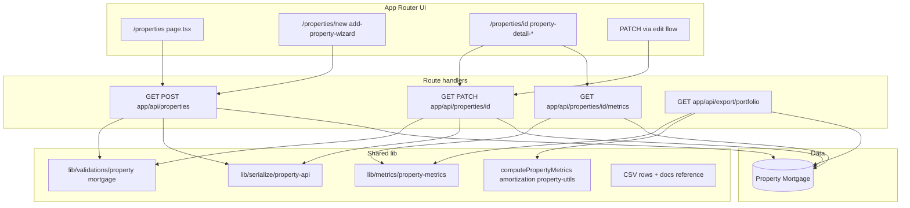

# Onboarding: properties vertical slice

This document traces how **property CRUD**, **computed metrics**, and **portfolio CSV export** flow through the Next.js app so new contributors can navigate the codebase quickly.

Aligned with [Architecture & build practices](../architecture-and-build-practices.md): Route Handlers authenticate and validate; **`lib/`** holds business logic and pure metric functions; Prisma stays behind **`lib/db.ts`**.

---

## End-to-end picture

---

## 1. UI entry points (`app/app/(app)/properties/`)

Paths below are relative to the **`app/`** package root (`RealEstatePortfolio/app/` — same as Vercel **Root Directory**).

| Area | Primary files |
|------|----------------|
| List | `app/app/(app)/properties/page.tsx`, `properties-card-grid.tsx`, toolbar/filters |
| Create | `app/app/(app)/properties/new/page.tsx`, `add-property-wizard.tsx` |
| Detail | `app/app/(app)/properties/[id]/page.tsx`, `property-detail-content.tsx`, tabs (`overview-tab-*`, mortgage workspace, projections) |
| Types | `app/app/(app)/properties/[id]/property-detail-types.ts` |

Client components typically call **`fetch("/api/properties…")`** with credentials; server components may load data via the same APIs or inline queries depending on the page.

---

## 2. Core REST handlers (`app/app/api/properties/`)

| Method / path | Role |
|-----------------|------|
| `GET/POST` [`api/properties/route.ts`](../../app/app/api/properties/route.ts) | List and create; rate limits (`properties:create`); validates with **`createPropertySchema`**; optional nested mortgage via **`createMortgageSchema`** / **`validateEscrowAmount`**; **`canAddProperty`** / **`getEffectiveTier`** from **`lib/plans`**; **`serializePropertyForApi`** for responses |
| `GET/PATCH` `app/app/api/properties/[id]/route.ts` | Single-property read/update; **`getPropertyForUser`** enforces **`userId`** scoping (no IDOR); **`updatePropertySchema`**; rate limit `properties:patch` |
| Related | `app/app/api/properties/[id]/mortgage/route.ts`, amortization/benchmark/metrics routes under the same segment |

---

## 3. Metrics JSON (`app/app/api/properties/[id]/metrics/route.ts`)

- Loads **`property`** + **`mortgages`** with **`userId`** filter.
- Uses **`getEffectiveBalance`** ([`lib/amortization`](../../app/lib/amortization.ts)), **`getPropertyTotalRent`** ([`lib/property-utils`](../../app/lib/property-utils.ts)), and **`computePropertyMetrics`** ([`lib/metrics/property-metrics.ts`](../../app/lib/metrics/property-metrics.ts)) with per **[ownership-metrics policy](../policies/ownership-metrics.md)** scaling (`ownershipPercent`).
- Returns pure computed JSON—same metric core as dashboards/export where applicable.

Portfolio aggregation lives in **`lib/metrics/portfolio-metrics.ts`** ([`computePortfolioMetrics`](../../app/lib/metrics/portfolio-metrics.ts)), built from per-property inputs.

---

## 4. CSV export (`app/app/api/export/portfolio/route.ts`)

- Auth + rate limit **`export:portfolio`**.
- Respects tier **`propertyLimit`** via **`getEffectiveTier`** / **`getPropertyLimit`**.
- Builds rows using **`computePropertyMetrics`**, **`getEffectiveBalance`**, **`parseUnitRentsFromDb`**, etc.
- Contract documented in **[portfolio CSV export](../reference/portfolio-csv-export.md)**—multi-mortgage columns and truncation behavior.

---

## 5. Tests that anchor this slice

| Concern | Tests |
|---------|--------|
| HTTP contracts | [`route.test.ts`](../../app/app/api/properties/route.test.ts); co-located tests under `app/app/api/properties/[id]/` (`route.test.ts`, `metrics/route.test.ts`, `mortgage/route.test.ts`); [`export/portfolio/route.test.ts`](../../app/app/api/export/portfolio/route.test.ts) |
| Metrics correctness | [`lib/metrics/portfolio-metrics.test.ts`](../../app/lib/metrics/portfolio-metrics.test.ts), [`metrics-golden.test.ts`](../../app/lib/metrics/metrics-golden.test.ts) |
| Validation | [`lib/validations/property.test.ts`](../../app/lib/validations/property.test.ts), [`mortgage.test.ts`](../../app/lib/validations/mortgage.test.ts) |
| Wizard UI smoke | `app/app/(app)/properties/add-property-wizard.test.tsx` |

---

## 6. Related docs

- [Property flow regression matrix](../qa/property-flow-regression-matrix.md)
- [Ownership metrics policy](../policies/ownership-metrics.md)
- [Analytics math policy](../policies/analytics-math-policy.md)
