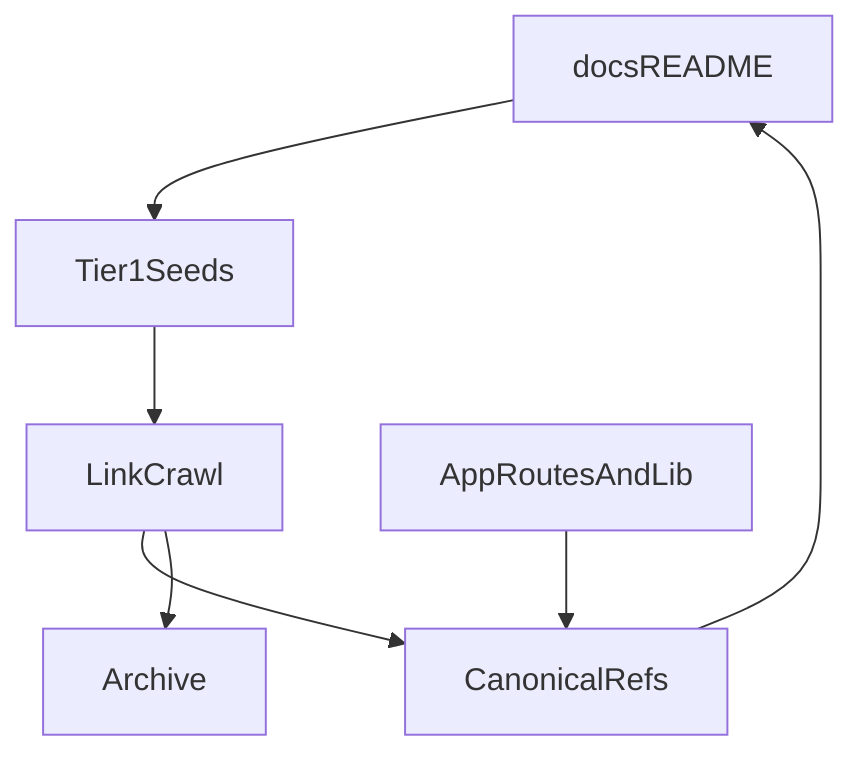

## Phase checklist

Track completion in PR descriptions or in 2026-doc-cleanup-working-log.md.

- [x] **A** Working log + inventory
- [x] **B** Link graph + broken-link report
- [x] **C** Hub + synthesis README + indexes
- [x] **D** Strategy / roadmap / valuation / specs / tasks / launch
- [x] **E** Engineering truth
- [x] **F** QA + security notes
- [x] **G** Audits corpus
- [x] **H** Plans, proposals, claudeCode
- [x] **I** Cursor / agent onboarding
- [x] **J** Automation
- [x] **K** Final verification + documentation-maintenance.md

# Workspace-wide documentation cleanup (no corners cut)

## Context (what we know today)

- **Primary hub:** [`RealEstatePortfolio/docs/README.md`](../../README.md) is the canonical entry; it links to tasks, roadmap, launch, QA, process, audits, archive, etc.
- **Scale:** ~**491 files** under [`RealEstatePortfolio/docs/`](../../) alone; audits repeat by date across **14 lanes**; synthesis folder accumulates generations.
- **Already-documented systemic issues** (do not rediscover blindly—use as a seed checklist, then verify fixed):
  - Stale **“latest synthesis”** pointers (process: update both [`docs/README.md`](../../README.md) and [`docs/audits/synthesis/README.md`](../../audits/synthesis/README.md) whenever a new `*-audit-synthesis.md` ships)—see [`docs/audits/documentation/2026-04-30-documentation-audit.md`](../../audits/documentation/2026-04-30-documentation-audit.md) and [`docs/audits/synthesis/2026-04-30-audit-synthesis.md`](../../audits/synthesis/2026-04-30-audit-synthesis.md).
  - **Broken relative links** from [`docs/archive/plans/`](../../archive/plans) and some plans using `(docs/...)` paths that resolve incorrectly—documented in multiple documentation audits (e.g. 2026-04-07, 2026-04-09, 2026-04-27).
  - **Strategic drift (watch on future edits):** Roadmap / valuation / tasks were realigned in **Phase D (2026-04-30)** to match App Router + trial/retention/shipped tools and Vitest **re-verify commands**; deeper drift should be caught by [`docs/audits/business/2026-04-30-business-valuation-audit.md`](../../audits/business/2026-04-30-business-valuation-audit.md) follow-ups.
  - **Dangling references (watchlist):** [`docs/process/AVAILABLE_AGENTS.md`](../../process/AVAILABLE_AGENTS.md) is canonical for agent/rule mapping (Phase I). Other historic gaps: [`docs/process/full-audit-synthesis.md`](../../process/full-audit-synthesis.md) example link to `tasks.md` wrong depth; root-level [`docs/audits/2026-04-05-*.md`](../../audits) vs lane-folder contract in [`docs/audits/README.md`](../../audits/README.md).
  - **Monorepo path truth:** skills live under **workspace** [`.cursor/skills/`](../../../../.cursor/skills) while app rules live under [`RealEstatePortfolio/.cursor/`](../../../.cursor)—agents referencing only `RealEstatePortfolio` paths will miss skills unless docs state this explicitly (raised in governance audits).

**Scope confirmed:** treat as one coherent corpus: `RealEstatePortfolio/docs/`, `claudeCode/**/*.md`, root [`docs/`](../../../../docs), and [`.cursor/`](../../../../.cursor) (rules, hooks, skills references), plus app-level README pointers ([`RealEstatePortfolio/app/README.md`](../../../app/README.md)).

---

## Guiding principles

1. **Single source of truth per topic** — Strategy (roadmap), external-facing valuation narrative, metrics policies, and “how to run” setup each get one canonical file; duplicates become stubs or archive with a one-line pointer.
2. **Live vs archive** — Anything not maintained must move under [`docs/archive/`](../../archive) (or `claudeCode/_archive/` if you choose) with a short `README` explaining why; **no silent deletion** of audit history.
3. **Judgement gates** — When intent is unclear (owner-only notes, one-off brainstorming, superseded plans, `claudeCode` handoffs), **stop for your decision**: keep in place, archive, merge into canonical doc, or delete with rationale in a short changelog entry.
4. **Measurable completeness** — Every phase ends with an artifact: inventory CSV/JSON, link report, diff list of “canonical updates,” or checklist sign-off.
5. **Agent working log (multi-session memory)** — Maintain one markdown file edited only for this cleanup program so any agent/session can reload state without relying on conversation context limits. It is **not** linked from [`docs/README.md`](../../README.md) (operators use the hub; agents use `_maintenance/`). Optional one-line pointer from Phase K [`documentation-maintenance.md`](../../process/documentation-maintenance.md): “large cleanups may use a dated working log under `_maintenance/`.”
6. **Implementation truth before PM ping** — If you are not sure whether something is **shipped in the product** (feature, route, cron, env contract, test count, etc.), **inspect the codebase and tests first** (e.g. `app/`, config, CI). If it is still ambiguous after that, **ask the PM** and record the answer in the working log under **Resolved judgements** so the next session does not re-litigate it.

---

## Phase A — Inventory and boundaries (foundation)

**Goal:** Enumerate everything documentation-like and classify by role.

- **A.0 Agent working log (do this first)** — Create [`docs/process/_maintenance/2026-doc-cleanup-working-log.md`](./2026-doc-cleanup-working-log.md) (path aligns with inventory deliverable folder). Top matter: banner **“Internal — doc cleanup running state; not the product hub.”** Include fixed sections:
  - **Plan link** — pointer to this Cursor plan file or issue/PR epic (whatever you use).
  - **Current phase / next actions** — one screenful max, updated whenever a session ends.
  - **Resolved PM judgements** — dated bullets (checkpoint A/B/D/etc. outcomes) so we do not re-ask.
  - **Open questions for PM** — blockers awaiting your call.
  - **Session appendix** — optional chronological “what we touched this session” (files, PR #s, link-report paths).
  Every Phase B–K session should skim this file **before** editing and append a short session note **after**.
- **A.1 Directory manifest** — List all paths under:
  - `RealEstatePortfolio/docs/**`
  - `claudeCode/**/*.md` (and note non-md artifacts)
  - `docs/**` at repo root (HTML and any md)
  - `.cursor/**/*.{mdc,md,json}` affecting agents
- **A.2 Content class tags** (per file or folder): `hub`, `canonical_reference`, `process`, `audit_immutable`, `plan_active`, `plan_superseded`, `launch_ops`, `qa`, `internal_owner`, `brainstorm`, `archive_candidate`, `unknown`.
- **A.3 “Entry point” list** — Treat as tier-1 seeds for link crawling: [`docs/README.md`](../../README.md), [`RealEstatePortfolio/README.md`](../../../README.md), root README if present, [`docs/audits/README.md`](../../audits/README.md), [`docs/cursor-agent-setup.md`](../../cursor-agent-setup.md), [`docs/tasks.md`](../../tasks.md).
- **Judgement checkpoint A:** Classify **`claudeCode/`** folders: retain as historical build log, move to `claudeCode/archive/`, or merge key facts into `docs/` (you decide per subtree or wholesale policy).

**Deliverable:** **`2026-doc-cleanup-working-log.md`** (running); plus `docs/process/_maintenance/2026-doc-cleanup-inventory.md` (or machine-readable `inventory.json` beside it) — path, class, last meaningful edit hint, owner “live?” flag.

---

## Phase B — Reference graph: every live link and target

**Goal:** “Search every live referenced doc” means **transitive closure** from tier-1 seeds plus any file that links *to* `docs/`.

- **B.1 Extract links** — Parse markdown `` and reference-style links, plus bare `docs/...` string mentions in `.mdc` rules. Include `claudeCode` and root `docs/`.
- **B.2 Resolve targets** — Classify each as: `internal_ok`, `internal_missing`, `anchor_unknown`, `external`, `repo_relative_ambiguous` (e.g. `docs/...` from `archive/plans/`).
- **B.3 Cross-repo pointers** — Flag references to `RealEstatePortfolio/...` from workspace root vs references that assume wrong cwd; flag `.cursor/skills/` vs `RealEstatePortfolio/.cursor` mismatch.
- **B.4 Orphans** — Files never reached from tier-1 seeds (candidates for archive index or explicit linking from hub).

**Deliverable:** Link report with broken-link list prioritized by **hub distance** (broken link on `docs/README.md` = P0; broken link only in archived plan = P2 unless it confuses search). Record report path(s) and “last crawl date” in **`2026-doc-cleanup-working-log.md`** so the next session does not repeat or lose the artifact location.

**Judgement checkpoint B:** For **large orphan clusters** (old `docs/research/`, `docs/brainstorms/`), decide: index from [`docs/README.md`](../../README.md), leave discoverable only via search, or archive.

---

## Phase C — Hub, navigation, and “latest pointer” hygiene

**Goal:** No reader hits stale “current” by accident.

- **C.1 Hub updates** — [`docs/README.md`](../../README.md): ensure Process list includes **mobile experience** process (per documentation audit), design hierarchy matches [`docs/policies/design-spec.md`](../../policies/design-spec.md) ↔ [`docs/design/design-spec-2026.md`](../../design/design-spec-2026.md), and quick links match actual latest synthesis.
- **C.2 Synthesis README** — [`docs/audits/synthesis/README.md`](../../audits/synthesis/README.md): canonical “latest full run,” naming footnote corrected to own the `-2` suffix story (per 2026-04-30 doc audit), one-line index for supplemental files like [`2026-04-29-user-clarifications-and-technical-notes.md`](../../audits/synthesis/2026-04-29-user-clarifications-and-technical-notes.md).
- **C.3 Secondary indexes** — [`docs/qa/README.md`](../../qa/README.md), [`docs/archive/README.md`](../../archive/README.md), lane [`docs/audits/*/README.md`](../../audits): ensure they describe retention policy (“latest vs history”) consistently.
- **C.4 Root `docs/`** — [`c:\Users\Refur\OneDrive\Documents\RealEstateProject\docs`](../../../../docs): either link into portfolio hub from a tiny `README.md` or move artifacts into [`RealEstatePortfolio/docs/archive/`](../../archive) — **judgement**: marketing HTML vs engineering docs.

**Deliverable:** Merged hub PR-ready edits + link report P0 cleared.

---

## Phase D — Canonical product and strategy alignment

**Goal:** Roadmap, specs, and valuation-facing docs match **shipped surfaces** and **measurable facts** from the codebase.

- **D.1 Route/surface parity pass** — Derive authoritative route list from [`RealEstatePortfolio/app/app/`](../../../app/app) (App Router segments) and reconcile with roadmap §1 table and [`docs/reference/product-overview.md`](../../reference/product-overview.md), [`docs/reference/mvp-spec.md`](../../reference/mvp-spec.md), [`docs/reference/engineering-spec.md`](../../reference/engineering-spec.md). Note renamed/removed routes.
- **D.2 Roadmap refresh** — [`docs/reference/roadmap.md`](../../reference/roadmap.md): replace brittle **hard-coded Vitest counts** with either current numbers **and** a “re-verify command” (`npm run test` in `app/`) or a policy to cite CI only; reconcile **reverse trial**, **retention/cron**, pricing, and any “future” bullets that already shipped (per business audits).
- **D.3 Valuation and positioning** — [`docs/reference/valuation-brief.md`](../../reference/valuation-brief.md): align §§ with roadmap (especially backlog vs shipped, test narrative vs **E2E** vs unit depth); ensure dates/metrics reflect your approval (some numbers are sensitive—PM-owned).
- **D.4 Tasks header alignment** — [`docs/tasks.md`](../../tasks.md): refresh “roadmap priority” table dates and.done items vs [`docs/tasks-archived.md`](../../tasks-archived.md) conventions; avoid duplicating roadmap backlog in two conflicting tables.
- **D.5 Launch and growth** — [`docs/launch/launch-plan.md`](../../launch/launch-plan.md) §9 and related telemetry docs vs live env/stripe/pricing parity (cross-check with [`app/lib/marketing/`](../../../app/lib/marketing) and pricing page).

**Judgement checkpoint D:** What to do with **quantitative business claims** (users, MRR, activation) in valuation brief—update from analytics, redact, or mark “as of DATE” with source.

---

## Phase E — Engineering truth: architecture, billing, data, policies

**Goal:** Internal docs match code modules and env contracts.

- **E.1 Architecture** — [`docs/architecture-and-build-practices.md`](../../architecture-and-build-practices.md) vs actual stack (Next version, Prisma, Clerk, Stripe, cron, Vercel); update folder conventions if `app/` layout shifted.
- **E.2 Policies vs implementation** — [`docs/policies/ownership-metrics.md`](../../policies/ownership-metrics.md), [`docs/policies/analytics-math-policy.md`](../../policies/analytics-math-policy.md) vs [`app/lib/`](../../../app/lib) source of truth; resolve cross-links to [`docs/process/math-logic-audit.md`](../../process/math-logic-audit.md) wording (synthesis item).
- **E.3 Billing and webhooks** — [`docs/internal/billing-matrix.md`](../../internal/billing-matrix.md) and related Stripe docs vs live API routes and env vars (see also reliability audit items: `CRON_SECRET`, health endpoint story).
- **E.4 Onboarding** — [`docs/onboarding/properties-vertical-slice.md`](../../onboarding/properties-vertical-slice.md), [`docs/onboarding/vitest-vs-route-handlers.md`](../../onboarding/vitest-vs-route-handlers.md) vs current patterns.
- **E.5 Runbooks** — [`docs/runbooks/`](../../runbooks) (if present) vs [`docs/setup/manual-steps.md`](../../setup/manual-steps.md), incident/liveness language aligned to actual [`GET /api/health`](../../../app) behavior.

**Judgement checkpoint E:** Which internal docs are **operator-only** (stay in `docs/internal/` or `owner_notes`) vs safe for all contributors.

---

## Phase F — QA, regression matrices, and security notes

**Goal:** Manual QA docs and security posture docs match current UI and threat model.

- **F.1 QA matrices** — [`docs/qa/property-flow-regression-matrix.md`](../../qa/property-flow-regression-matrix.md), mobile verification docs vs current tabs/shells.
- **F.2 Test infrastructure narrative** — [`docs/qa/test-infrastructure-review.md`](../../qa/test-infrastructure-review.md), [`docs/qa/testing-hardening-proposal.md`](../../qa/testing-hardening-proposal.md) vs actual suite layout and CI.
- **F.3 Security docs** — [`docs/security/`](../../security) vs latest security audits; ensure “open” items in audits are either reflected in tasks or explicitly accepted risk.

---

## Phase G — Audits corpus: structure, retention, and noise control

**Goal:** Audits stay **immutable history** but don’t break navigation contracts.

- **G.1 Lane contract** — Enforce [`docs/audits/README.md`](../../audits/README.md): move or index root-level `docs/audits/2026-04-05-*.md`; update all `audit:` frontmatter in plans that point at old paths.
- **G.2 Synthesis discipline** — After each future full run, enforce two-file update rule (main `docs/README` + `audits/synthesis/README`); add a line to [`docs/process/full-audit-synthesis.md`](../../process/full-audit-synthesis.md) PM checklist.
- **G.3 Retention policy (optional compression)** — If volume is too high for humans: per lane, keep **all** audits in place but add **lane README** “recommended reading order” (latest + prior continuity); *only with your approval*, move runs older than N months to `docs/archive/audits/<lane>/YYYY/` to reduce noise.

**Judgement checkpoint G:** Whether to physically archive old audit files or only improve indexes (legal/compliance and security audits often want full retention in place).

---

## Phase H — Plans, proposals, brainstorms, and `claudeCode` handoffs

**Goal:** Active plans obvious; superseded plans clearly historical; `claudeCode` either integrated or quarantined.

- **H.1 Active vs archive** — [`docs/plans/`](../../plans) vs [`docs/archive/plans/`](../../archive/plans): each active plan has valid frontmatter targets (fix [`2026-04-05-edit-page-completion-guidance.md`](../../plans/2026-04-05-edit-page-completion-guidance.md) `research:` / `audit:` story per documentation audit).
- **H.2 Proposals** — [`docs/proposals/`](../../proposals): link implemented items to code or move to archive.
- **H.3 `claudeCode/`** — For each handoff (`PropertyRedesign`, `DashRedesign`, etc.): extract **durable** decisions into `docs/decisions/` or [`docs/architecture-and-build-practices.md`](../../architecture-and-build-practices.md); mark folder as **historical** with a top-level `claudeCode/README.md` index; fix any paths that assume wrong repo layout.

**Judgement checkpoint H:** Which `claudeCode` artifacts are **still operational runbooks** vs **obsolete narrative** (your per-folder sign-off).

---

## Phase I — Agent governance: `.cursor` and contributor onboarding

**Goal:** Cursor rules, hooks, and human docs agree.

- **I.1 Setup guide** — [`docs/cursor-agent-setup.md`](../../cursor-agent-setup.md): “Other focused audits” either names all 14 lanes or defers exclusively to [`docs/audits/README.md`](../../audits/README.md) (per agent-governance audit).
- **I.2 Rules vs process** — Reconcile [`docs/process/*-audit-process.md`](../../process) with matching [`.cursor/rules/*-audit-agent.mdc`](../../../.cursor/rules) for subagent vs inline execution (documentation and agent-governance lanes called out explicitly).
- **I.3 `AVAILABLE_AGENTS.md` resolution** — Canonical table: [`docs/process/AVAILABLE_AGENTS.md`](../../process/AVAILABLE_AGENTS.md); linked from [`docs/tasks-tools-expansion.md`](../../tasks-tools-expansion.md) and [`docs/plans/2026-04-09-audit-remediation-plan.md`](../../plans/2026-04-09-audit-remediation-plan.md).
- **I.4 Monorepo skills path** — Document in [`docs/cursor-agent-setup.md`](../../cursor-agent-setup.md) or [`docs/setup/ai-process-workflow-setup.md`](../../setup/ai-process-workflow-setup.md) that **Veld UI skills** live at workspace `.cursor/skills/...`, not under `RealEstatePortfolio/.cursor/`.
- **I.5 Command integrity** — Run through [`docs/process/command-integrity-check.md`](../../process/command-integrity-check.md) after rule edits; add cross-link from [`docs/process/agent-governance-audit-process.md`](../../process/agent-governance-audit-process.md) if still missing.

---

## Phase J — Automation and ongoing prevention

**Goal:** Make drift visible before the next mega-cleanup.

- **J.1 Link checker** — Add a repeatable script (Node or Python) in `RealEstatePortfolio` or workspace root that scans markdown under the agreed scopes and fails on broken **internal** links (respect relative path rules from `archive/`).
- **J.2 Metrics refresh helper** — Small script or documented one-liner: output current Vitest file/test counts and optional route list for paste into roadmap (or generate a `docs/reference/_generated-metrics.md` **if** you want machine-updated snippets—judgement: avoid noise in git vs manual semiannual refresh).
- **J.3 Optional CI** — Run link check on PRs touching `docs/` or weekly schedule (lightweight).

**Judgement checkpoint J:** Whether generated files are acceptable in-repo or you prefer purely manual updates.

---

## Phase K — Final verification and sign-off

- **K.1 Re-run transitive link crawl** — Zero P0/P1 broken links from hubs; acceptable level of P2 in strict archive.
- **K.2 Spot-read** — Random sample 20 files across classes for “sounds like current product.”
- **K.3 Audit synthesis** — Close documentation-related **Schedule/Ship** items from latest [`docs/audits/synthesis/2026-04-30-audit-synthesis.md`](../../audits/synthesis/2026-04-30-audit-synthesis.md) or open a new doc-audit if scope expanded materially.
- **K.4 Maintenance doc** — Short `docs/process/documentation-maintenance.md`: post-synthesis pointer update, quarterly link check, command-integrity calendar; optionally one line referencing `_maintenance/` working logs for future large cleanups.
- **K.5 Working log disposition** — Either freeze **`2026-doc-cleanup-working-log.md`** as a historical appendix (shows what was decided) or distill durable outcomes into [`documentation-maintenance.md`](../../process/documentation-maintenance.md) then archive the log under `docs/archive/process/` — **judgement**: keep for a few quarters vs trim once sign-off is done.

---

## How to execute (operator playbook)

**Should you click Build once on the whole plan?** **No** — not as a single monolithic run. The plan is intentionally large; one-shot execution risks shallow passes, merge conflicts, hard-to-review diffs, and dropped judgement gates. Treat the Cursor plan as the **map**, the working log as the **session state**, and each chat/Build as one **slice**.

**Do you need a separate “phased plan document” in the repo?** **Optional.** The phases A–K here are already the staged breakdown. If you want a repo-local checklist (for you or non-Cursor contributors), add a short `docs/process/_maintenance/2026-doc-cleanup-checklist.md` that mirrors phase headings and checkboxes only — no duplicate prose. The **canonical** phase detail stays in this plan file; the checklist is just a progress tracker with links back here.

### Recommended rhythm

1. **Start Phase A** — Create `2026-doc-cleanup-working-log.md` (A.0), then inventory. One PR is fine for “scaffolding + inventory” (low risk).
2. **Phase B** — Generate link report; store path and date in the working log. Can be the same PR as A if small, or a follow-up PR that only adds reports + log updates.
3. **Phase C (and quick doc-audit fixes)** — Hub/synthesis README / P0 links. **Small, reviewable PR** — high visibility.
4. **Phases D–F** — Content alignment (strategy, engineering, QA). Split into **2–3 PRs** (e.g. D alone, E+F together) so roadmap/valuation get human read time.
5. **Phases G–H** — Moves and archive/index work; **separate PR** — easy to revert if a path annoys grep.
6. **Phase I** — `.cursor` and rules — **own PR** if you want crisp review of governance changes.
7. **Phase J** — Scripts/CI — **own PR** (code + docs).
8. **Phase K** — Final crawl + maintenance doc + working-log disposition — **closing PR**.

### Using Cursor Build

- **Prefer:** Build (or Agent) with an **explicit scope**: e.g. “Execute Phase C only per plan docs_workspace_cleanup; read working log first; update log after.”
- **Avoid:** “Do the entire documentation plan” without a phase boundary unless you deliberately accept a long review burden.

### Judgement gates

Whenever a checkpoint says **stop for PM**: do not lump that into an automated batch — note it in the working log **Open questions**, get your answer, record under **Resolved judgements**, then continue.

### When you are unsure (product vs doc)

- **Shipped or not?** Search or read the relevant code under `RealEstatePortfolio/app/` (routes, `lib/`, API handlers, cron, marketing copy). Run or skim tests if that is the fastest way to settle “does this exist / behave this way?”
- **Still unclear** (naming, retention policy, business numbers, legal, or anything code cannot answer) — **ask the PM**; add to **Open questions** in the working log until answered.

### When a separate checklist file helps

- Multiple people touching docs, or sessions spread over weeks — checkbox file + working log beats memory.
- Solo + steady Cursor cadence — working log alone may be enough.

---

## Mermaid — documentation flow after cleanup

