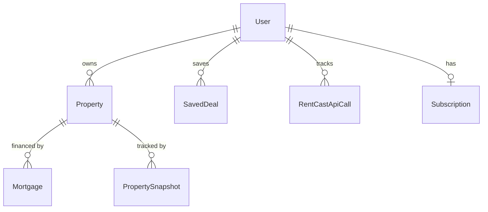
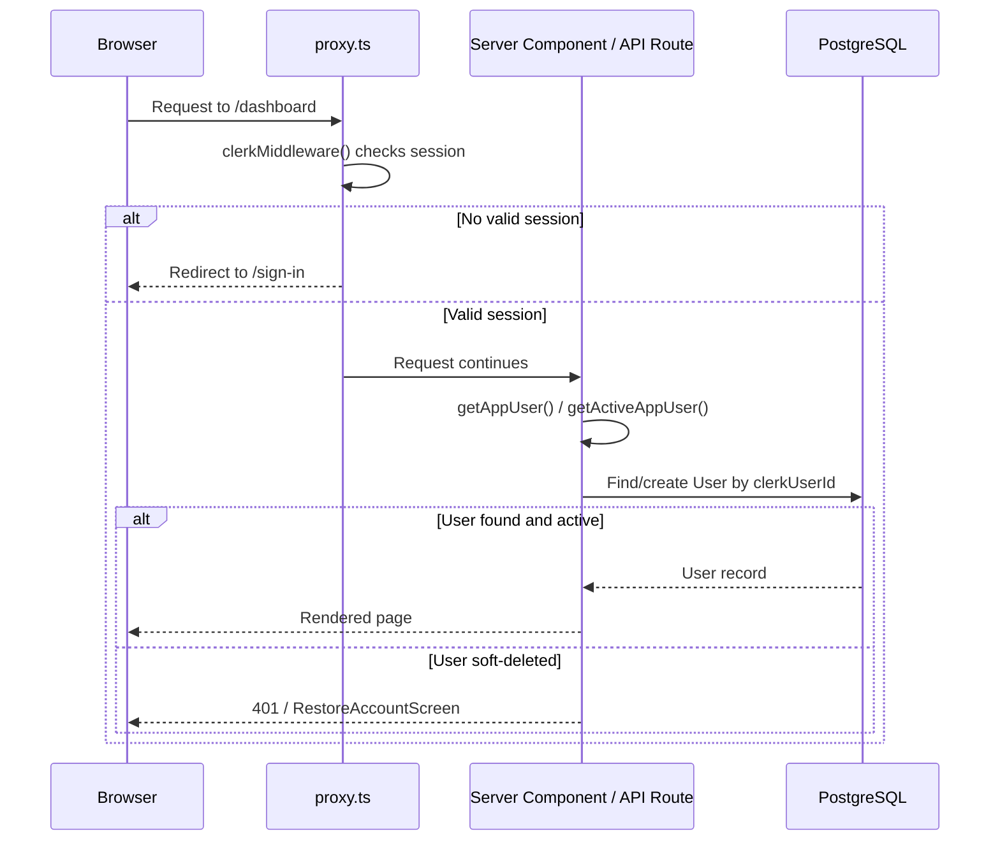
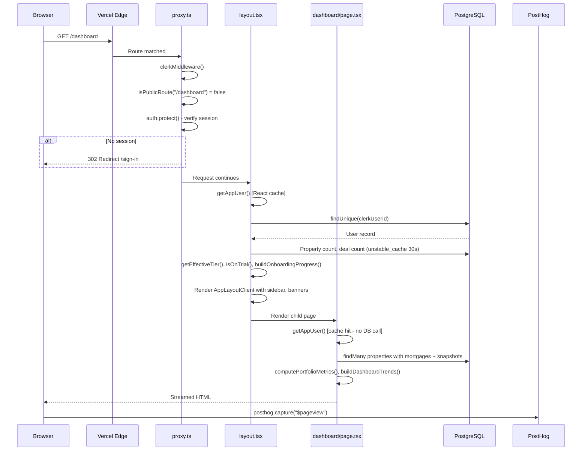
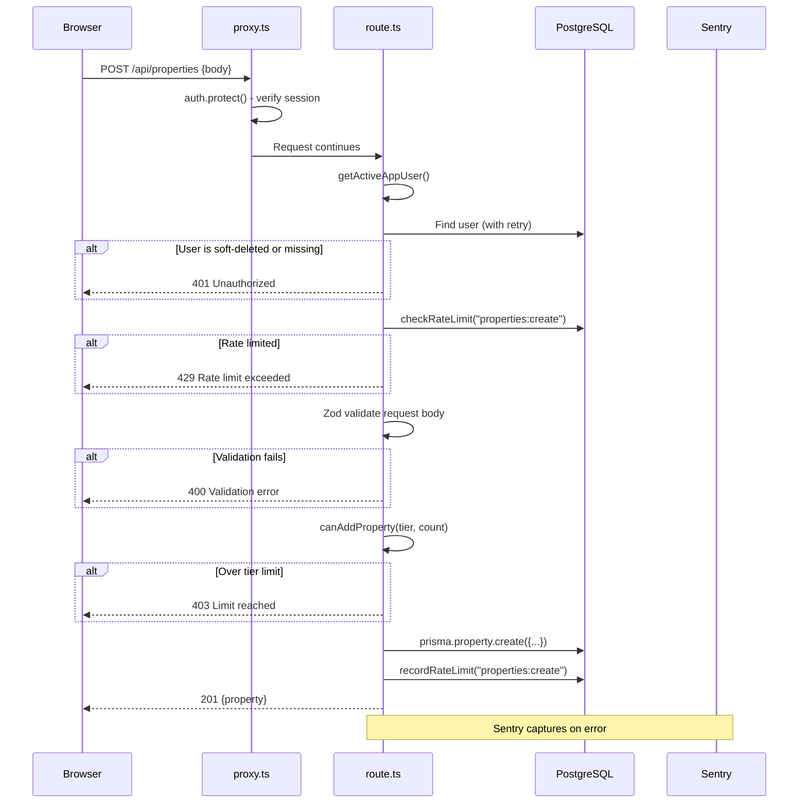
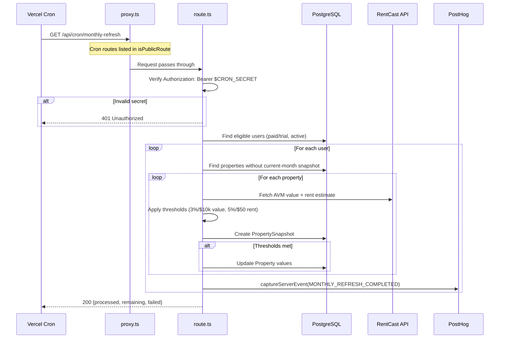
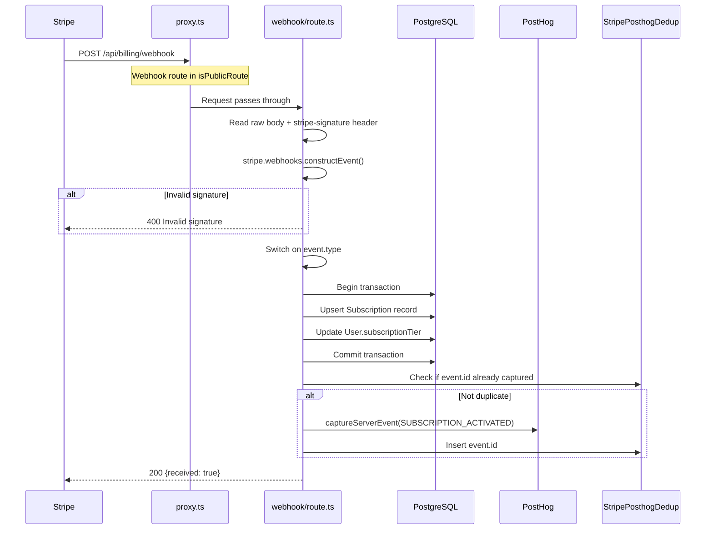
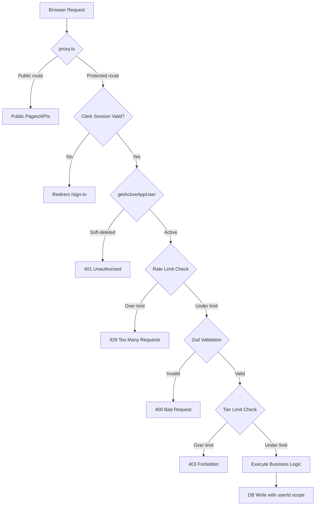

# Veld Portfolio: The Complete Engineering & Product Reference

> **Last updated:** April 2026
> **Audience:** Solo founder who knows the product but needs the codebase internalized
> **Source of truth:** The actual code. Where existing docs in `/docs` conflict with what the code does, this document follows the code.

---

## Table of Contents

1. [Architecture Overview](#chapter-1--architecture-overview)
2. [Data Layer](#chapter-2--data-layer)
3. [Authentication & Authorization](#chapter-3--authentication--authorization)
4. [Payments & Subscriptions](#chapter-4--payments--subscriptions)
5. [Core Feature Systems](#chapter-5--core-feature-systems)
6. [Math, Financial Formulas & Computation Engine](#chapter-6--math-financial-formulas--computation-engine)
7. [Shared Infrastructure](#chapter-7--shared-infrastructure)
8. [Terminology & Glossary](#chapter-8--terminology--glossary)
9. [Strengths & Technical Debt](#chapter-9--strengths--technical-debt)
10. [Demo Preparedness](#chapter-10--demo-preparedness)
11. [What's Missing / Next Layer](#chapter-11--whats-missing--next-layer)
12. [Request Lifecycle & Data Flow](#chapter-12--request-lifecycle--data-flow)
13. [Local Development Setup & Environment](#chapter-13--local-development-setup--environment)
14. [Testing](#chapter-14--testing)
15. [Security Model](#chapter-15--security-model)
16. [Client-Side State & UI Patterns](#chapter-16--client-side-state--ui-patterns)
17. [Known Gotchas & Pitfalls](#chapter-17--known-gotchas--pitfalls)
18. [External Dependency Map](#chapter-18--external-dependency-map)
19. [Marketing & SEO Surface](#chapter-19--marketing--seo-surface)
20. [State of the App Today & Where This Could Go](#chapter-20--state-of-the-app-today--where-this-could-go)

---

## Chapter 1 -- Architecture Overview

### What Veld Portfolio Is

Veld Portfolio is a Next.js web application that replaces the spreadsheets small passive landlords use to track their rental properties. It computes investment metrics (cap rate, NOI, equity, cash flow), models mortgage amortization, runs deal analysis, and automates monthly portfolio snapshots backed by third-party valuation data. It is a production-deployed SaaS at veldportfolio.com with Stripe billing, Clerk authentication, and a rich marketing surface.

### Tech Stack (April 2026)

| Layer | Technology | Version |
|-------|-----------|---------|
| Framework | Next.js (App Router) | 16.1.6 |
| UI Library | React | 19.2.3 |
| Language | TypeScript | 5.x |
| Auth | Clerk (`@clerk/nextjs`) | 6.14.0 |
| ORM | Prisma | 6.19.2 |
| DB Adapter | `@prisma/adapter-pg` | 7.5.0 |
| Database | PostgreSQL (Neon) | -- |
| Payments | Stripe | 20.4.1 |
| Styling | Tailwind CSS | 4.x |
| Validation | Zod | 4.3.6 |
| Error Monitoring | Sentry (`@sentry/nextjs`) | 10.44.0 |
| Analytics | PostHog | 1.362.0 |
| Charts | Recharts | 2.x |
| Email | Resend | 4.x |
| Testing | Vitest | 4.1.0 |

### Directory Structure

The repository root is `RealEstatePortfolio/`. This is **not** a monorepo. The `app/` directory inside `RealEstatePortfolio/` is the Next.js application root. When you run `npm run dev`, you run it from `RealEstatePortfolio/app/`.

```
RealEstatePortfolio/
├── app/                          # <-- THIS IS THE NEXT.JS APP
│   ├── app/                      # Next.js App Router pages
│   │   ├── (app)/                # Authenticated route group (force-dynamic)
│   │   │   ├── dashboard/        # Main dashboard
│   │   │   ├── properties/       # Property CRUD
│   │   │   ├── analyze/          # Deal analyzer
│   │   │   ├── modeling/         # Forward projections
│   │   │   ├── mortgage/         # Mortgage workspace
│   │   │   ├── refinance/        # Refinance scenarios
│   │   │   ├── settings/         # User settings
│   │   │   ├── admin/            # Admin dashboard
│   │   │   ├── layout.tsx        # Authenticated layout (server)
│   │   │   ├── app-layout-client.tsx  # Authenticated layout (client)
│   │   │   └── app-nav.tsx       # Navigation component
│   │   ├── api/                  # API routes (~48 route files)
│   │   │   ├── billing/          # Stripe checkout, webhook, portal, sync
│   │   │   ├── properties/       # Property CRUD endpoints
│   │   │   ├── deals/            # Deal CRUD endpoints
│   │   │   ├── cron/             # 7 cron job routes
│   │   │   ├── contact/          # Contact form
│   │   │   ├── health/           # Health check
│   │   │   └── ...
│   │   ├── sign-in/              # Clerk sign-in catch-all
│   │   ├── sign-up/              # Clerk sign-up catch-all
│   │   ├── pricing/              # Public pricing page
│   │   ├── tools/                # Public calculator pages
│   │   ├── alternatives/         # Competitor comparison pages
│   │   ├── vs/                   # Product comparison pages
│   │   ├── resources/            # Resource articles
│   │   ├── page.tsx              # Landing page (public)
│   │   ├── layout.tsx            # Root layout
│   │   ├── sitemap.ts            # Dynamic sitemap generation
│   │   └── robots.ts             # Robots.txt generation
│   ├── components/               # ~64 React components
│   ├── lib/                      # ~109 library modules
│   │   ├── metrics/              # Property & portfolio metrics
│   │   ├── validations/          # Zod schemas
│   │   ├── serialize/            # API serializers
│   │   ├── integrations/         # Third-party API adapters
│   │   ├── marketing/            # Marketing page data
│   │   ├── emails/               # Email templates
│   │   ├── import/               # CSV import logic
│   │   └── ...                   # Auth, plans, amortization, etc.
│   ├── prisma/
│   │   └── schema.prisma         # Database schema
│   ├── proxy.ts                  # Network boundary (auth proxy)
│   ├── next.config.ts            # Next.js configuration
│   ├── package.json              # Dependencies and scripts
│   ├── vercel.json               # Vercel cron jobs
│   └── .env.example              # Environment variable template
└── docs/                         # Documentation
    ├── reference/                # Engineering spec, product overview, etc.
    ├── design/                   # Design system spec
    └── ...
```

### Routing Architecture

Next.js 16 App Router with two route groups:

**Public routes** (top-level under `app/app/`): Landing page, pricing, tools, alternatives, vs, resources, sign-in, sign-up, privacy, terms, changelog, contact. These are accessible without authentication.

**Authenticated routes** (`app/app/(app)/`): Dashboard, properties, analyze, modeling, mortgage, refinance, settings, admin. The `(app)` route group applies `force-dynamic` rendering (no static optimization) and wraps all children in the authenticated layout that fetches the current user.

### proxy.ts -- The Network Boundary

In Next.js 16, `middleware.ts` was replaced by `proxy.ts`. The file lives at `app/proxy.ts` and is the first code that runs for every matched request. It uses Clerk's `clerkMiddleware()` with `createRouteMatcher()` to protect routes:

```typescript
// app/proxy.ts
const isPublicRoute = createRouteMatcher([
  "/", "/sitemap.xml", "/robots.txt",
  "/sign-in(.*)", "/sign-up(.*)",
  "/privacy", "/terms", "/pricing",
  "/investment-property-calculator",
  "/tools(.*)", "/alternatives(.*)", "/vs(.*)", "/resources(.*)",
  "/lp/investment-property-calculator", "/changelog", "/contact",
  "/api/billing/webhook",
  "/api/cron/onboarding-emails", "/api/cron/trial-emails",
  "/api/cron/rate-limit-cleanup",
  "/api/contact", "/api/csp-report", "/api/health", "/api/unsubscribe",
]);

export default clerkMiddleware(async (auth, req) => {
  if (!isPublicRoute(req)) {
    await auth.protect();
  }
});
```

The proxy runs on the Node.js runtime (not Edge). If a route is not in the public list, `auth.protect()` blocks the request and redirects to `/sign-in`. This is the first layer of authentication. The second layer happens in server components and API routes via `getAppUser()` / `getActiveAppUser()`.

### Build Pipeline

1. `prisma migrate deploy` -- applies pending migrations
2. `next build` -- builds the Next.js application
3. Sentry wrapping via `withSentryConfig()` in `next.config.ts`
4. Deployed to Vercel with `vercel.json` cron definitions

### Key Configuration Files

- **`next.config.ts`**: Sentry integration, CSP headers (report-only by default), security headers (HSTS, X-Frame-Options, etc.), redirects, Turbopack configuration
- **`vercel.json`**: 7 cron job schedules
- **`package.json`**: All dependencies and scripts (`dev`, `build`, `lint`, `test`, `db:*`)
- **`.env.example`**: Template for all environment variables
- **`lib/env.ts`**: Runtime validation of required env vars

### Global Provider Stack

The root layout (`app/app/layout.tsx`) wraps the entire application in a provider stack:

```
ClerkProvider
  └── CookieConsentProvider
       └── PostHogGate
            └── ThemeProvider (next-themes)
                 └── children
```

`PostHogGate` initializes PostHog in anonymous memory-only mode for all visitors. When cookie consent is granted, it upgrades to full persistent mode with user identification. This respects GDPR/CCPA while still capturing basic funnel data.

---

## Chapter 2 -- Data Layer

### Database

PostgreSQL hosted on Neon. The Prisma client uses `@prisma/adapter-pg` (the driver adapter pattern), not the traditional Prisma binary engine. The client is instantiated as a global singleton in development to survive HMR, and fresh per request in production.

**`lib/db.ts`** creates the PrismaClient:

```typescript
import { PrismaClient } from "@prisma/client";
import { PrismaPg } from "@prisma/adapter-pg";

const adapter = new PrismaPg({ connectionString: process.env.DATABASE_URL });
const globalForPrisma = globalThis as unknown as { prisma: PrismaClient };
export const prisma = globalForPrisma.prisma || new PrismaClient({ adapter });
if (process.env.NODE_ENV !== "production") globalForPrisma.prisma = prisma;
```

The `directUrl` in the schema is for migrations (bypasses Neon's connection pooler for DDL operations).

### Schema -- 10 Models

#### User

The central model. Every authenticated person has one User record, created on first sign-in via `getAppUser()`.

| Field | Type | Purpose |
|-------|------|---------|
| `id` | String (cuid) | Internal primary key |
| `clerkUserId` | String (unique) | Links to Clerk identity |
| `email` | String | Synced from Clerk on each request |
| `firstName`, `lastName` | String? | Synced from Clerk |
| `subscriptionTier` | String ("free"/"investor"/"pro") | Current paid tier from Stripe |
| `subscriptionTierOverride` | String? | Admin override (bypasses Stripe) |
| `trialStartedAt`, `trialEndsAt` | DateTime? | 14-day trial window |
| `trialEmailsSentAt` | Json? | Tracks which trial emails were sent |
| `stripeCustomerId` | String? | Stripe customer ID |
| `ownershipDisplayMode` | String? | "proportional" or "full_liability" |
| `onboardingWelcomeSeenAt` | DateTime? | When user saw welcome modal |
| `onboardingDismissedAt` | DateTime? | When user dismissed onboarding |
| `onboardingModeledAt` | DateTime? | When user first used modeling |
| `onboardingEmailsSentAt` | Json? | Tracks onboarding re-engagement emails |
| `onboardingEmailsOptedOutAt` | DateTime? | Unsubscribed from onboarding emails |
| `lastActiveAt` | DateTime? | Throttled to once per 24h |
| `digestEmailsSentAt` | Json? | Month keys tracking digest sends |
| `digestEmailsOptedOutAt` | DateTime? | Unsubscribed from digest/milestones |
| `mortgageMilestonesSentAt` | Json? | Tracks milestone email sentinels |
| `winbackEmailsSentAt` | Json? | Tracks winback email stages |
| `deletedAt` | DateTime? | Soft delete (RestoreAccountScreen) |

**Relations:** `properties[]`, `savedDeals[]`, `rentCastApiCalls[]`, `subscription?`

#### Property

A tracked rental property in the user's portfolio.

| Field | Type | Purpose |
|-------|------|---------|
| `id` | String (cuid) | Primary key |
| `userId` | String | Owner (FK to User) |
| `nickname` | String? | User-friendly label |
| `addressLine1/2`, `city`, `state`, `zipCode` | String | Physical address |
| `propertyType` | String | single_family, condo, townhouse, manufactured, multi_family, apartment |
| `units` | Int (default 1) | Number of units |
| `ownershipPercent` | Int (1-100) | Partial ownership support |
| `purchasePrice` | Decimal(14,2) | Original purchase price |
| `purchaseDate` | Date | When purchased |
| `currentEstimatedValue` | Decimal(14,2) | Current market value estimate |
| `currentMonthlyRent` | Decimal(12,2) | Total monthly rent |
| `isRented` | Boolean | Whether currently rented |
| `unitRents` | Json? | Per-unit rent array (multi-family) |
| `bedrooms`, `bathrooms`, `squareFeet` | Int?/Decimal? | Physical details |
| `hasMortgage` | Boolean? | Flag for mortgage existence |
| `currentMonthlyExpenses` | Decimal(12,2) | Monthly operating expenses |
| `vacancyPercent` | Int (0-100, default 5) | Expected vacancy rate |
| `cashInvested` | Decimal(14,2)? | Total cash put into property |
| `marketRent` | Decimal(12,2)? | RentCast market rent estimate |
| `marketRentAsOf` | Date? | When market rent was fetched |
| `estimatedValueAsOf` | Date? | When AVM value was fetched |

**Relations:** `user` (User), `mortgages[]` (Mortgage), `snapshots[]` (PropertySnapshot)

#### Mortgage

A loan attached to a property. Properties can have multiple mortgages (first, second, HELOC).

| Field | Type | Purpose |
|-------|------|---------|
| `originalLoanAmount` | Decimal(14,2) | Original principal |
| `currentBalance` | Decimal(14,2) | Most recent statement balance |
| `balanceAsOfDate` | Date? | When `currentBalance` was recorded |
| `interestRate` | Decimal(6,4) | Annual rate as decimal (e.g. 0.0650) |
| `termYears` | Int | Loan term in years |
| `startDate` | Date | When the loan originated |
| `monthlyPayment` | Decimal(12,2) | Total monthly payment (may include escrow) |
| `paymentEffectiveDate` | Date? | When the payment amount took effect |
| `escrowIncluded` | Boolean | Whether `monthlyPayment` includes escrow |
| `escrowAmount` | Decimal(12,2)? | Monthly escrow portion |
| `lenderName` | String? | Lender name |
| `loanType` | String? | conventional, fha, etc. |

**Relation:** `property` (Property, cascade delete)

#### PropertySnapshot

Monthly point-in-time record of a property's metrics. Created by the monthly refresh cron or on property creation.

| Field | Type | Purpose |
|-------|------|---------|
| `propertyId` | String | FK to Property |
| `snapshotMonth` | Date | First of the month (UTC) |
| `estimatedValue` | Decimal(14,2) | Value at snapshot time |
| `effectiveMortgageBalance` | Decimal(14,2) | Computed balance at snapshot time |
| `equity` | Decimal(14,2) | Value minus balance |
| `marketRent` | Decimal(12,2)? | Market rent at snapshot time |
| `monthlyRent` | Decimal(12,2) | Actual rent at snapshot time |
| `monthlyCashFlow` | Decimal(12,2) | Cash flow at snapshot time |
| `capRate` | Decimal(8,6)? | Cap rate at snapshot time |
| `ltv` | Decimal(8,6)? | LTV at snapshot time |
| `avmValueRaw` | Decimal(14,2)? | Raw AVM value from RentCast |
| `avmRentRaw` | Decimal(12,2)? | Raw AVM rent from RentCast |
| `avmValueApplied` | Boolean | Whether AVM value was auto-applied |
| `avmRentApplied` | Boolean | Whether AVM rent was auto-applied |

**Unique constraint:** `[propertyId, snapshotMonth]` -- one snapshot per property per month.

#### SavedDeal

A deal analysis that the user saved. Structurally similar to Property but without mortgages or snapshots.

Key differences from Property: no `purchaseDate`, no `units`, no `unitRents`, no `isRented`, has `notes`. Deals are scratchpad analyses, not tracked portfolio members.

#### Subscription

One-to-one with User. Synced from Stripe webhooks.

| Field | Type | Purpose |
|-------|------|---------|
| `stripeSubscriptionId` | String? | Stripe subscription ID |
| `status` | String | active, canceled, past_due, etc. |
| `planName` | String? | e.g. "investor_monthly", "pro_yearly" |
| `currentPeriodEnd` | DateTime? | When current billing period ends |
| `cancelAtPeriodEnd` | Boolean? | User canceled but has access until period end |

#### RentCastApiCall

Tracks every successful call to the RentCast API. Used for per-user hourly quota enforcement. All RentCast-backed endpoints (rent estimate, value estimate, benchmark refresh) share one counter per user per hour.

#### ContactFormSubmission

Rate limiting for the contact form. Uses `identifier` (userId or IP) to limit submissions per hour.

#### ApiRateLimitEntry

Generic rate limiting table. Stores `identifier` + `action` + `createdAt`. All API write endpoints check against this table before proceeding. Cleaned up hourly by a cron job.

#### StripePosthogDedup

Prevents duplicate PostHog analytics events when Stripe retries webhooks. Stores `eventId` (the Stripe event ID) as the primary key. Before firing a PostHog event from a webhook, the handler checks if the event ID already exists.

### Entity Relationship Diagram



### Where DB Queries Happen

All database queries go through the `prisma` singleton from `lib/db.ts`. There are approximately 48 API route files, and queries occur in:

- **Server components**: `(app)/layout.tsx`, `dashboard/page.tsx`, `properties/[id]/page.tsx`, `modeling/page.tsx`, `mortgage/page.tsx`, `refinance/page.tsx`, `settings/page.tsx`, `admin/page.tsx`
- **API routes**: Every route in `api/properties/`, `api/deals/`, `api/billing/`, `api/cron/`, `api/account/`, `api/estimates/`
- **Auth**: `lib/auth.ts` (user upsert via `getAppUser()`)
- **Cron jobs**: `lib/refresh.ts`, `lib/emails/trial-lifecycle.ts`, cron route handlers

### Validation Layer

All API write endpoints validate input with Zod schemas defined in `lib/validations/`:

- **`property.ts`**: `createPropertySchema`, `patchPropertySchema`
- **`mortgage.ts`**: `createMortgageSchema`, `patchMortgageSchema`, `validateEscrowAmount()`
- **`deal.ts`**: `createDealSchema`, `patchDealSchema`
- **`checkout.ts`**: `createCheckoutSchema`

### Serialization

`lib/serialize/property-api.ts` provides `serializePropertyForApi()` which converts Prisma Decimal fields to numbers for JSON responses. This is necessary because Prisma Decimal types serialize as objects, not numbers.

---

## Chapter 3 -- Authentication & Authorization

### Two-Layer Authentication Model

Veld uses a two-layer auth model where both layers must agree for a request to succeed:



**Layer 1 -- proxy.ts (Network Boundary):** Clerk's `clerkMiddleware()` verifies the session token. Non-public routes call `auth.protect()` which blocks unauthenticated requests entirely. This runs before any page or API code.

**Layer 2 -- getAppUser() / getActiveAppUser() (Application Boundary):** Server components and API routes call these functions to get the local DB user record. `getAppUser()` upserts the Clerk user into the local User table. `getActiveAppUser()` adds a soft-delete filter.

### getAppUser() -- The Core Auth Function

Defined in `lib/auth.ts`. Wrapped with React `cache()` so that within a single server request, the layout and its child pages share the same result (no duplicate DB queries).

What it does on every authenticated request:

1. Calls `currentUser()` from Clerk to get the authenticated user
2. Extracts primary email from Clerk (handles OAuth sign-ins where `sessionClaims.email` is often empty)
3. Looks up the User by `clerkUserId` in the local DB
4. If found: syncs email/name if changed, touches `lastActiveAt` (throttled to once per 24h), returns
5. If not found: creates a new User with a 14-day trial (`trialStartedAt: now`, `trialEndsAt: now + 14 days`), fires `TRIAL_STARTED` analytics event
6. Race-safe: catches `P2002` (unique constraint violation) if two concurrent requests both try to create the same user

All Prisma operations are wrapped in `withPrismaRetry()` which retries up to 3 times with exponential backoff (200ms, 400ms) on transient connection failures.

### getActiveAppUser()

Same as `getAppUser()` but returns `null` if `user.deletedAt` is set. Use this in API routes where soft-deleted users should not have access. Use `getAppUser()` (without the active filter) in the layout (which needs to render the RestoreAccountScreen for deleted users) and in the restore account route itself.

### Admin Access

`isAdmin()` in `lib/auth.ts` checks if the user's email is in the `ADMIN_EMAILS` environment variable (comma-separated list). The admin layout at `(app)/admin/layout.tsx` gates access using this function. There is no role column in the database -- admin is purely env-based.

### Sign-In / Sign-Up

Clerk catch-all routes at `app/app/sign-in/[[...sign-in]]/page.tsx` and `app/app/sign-up/[[...sign-up]]/page.tsx` render Clerk's managed components. These routes are listed in the `isPublicRoute` matcher in `proxy.ts`.

---

## Chapter 4 -- Payments & Subscriptions

### Plan Tiers

Defined in `lib/plans.ts`:

| Tier | Properties | Deals | RentCast/hour | Monthly | Yearly |
|------|-----------|-------|--------------|---------|--------|
| Free | 1 | 5 | 5 | $0 | $0 |
| Investor | 5 | 20 | 10 | $15 | $150 |
| Pro | 20 | 50 | 20 | $29 | $290 |

### Effective Tier Resolution

`getEffectiveTier()` in `lib/plans.ts` determines what tier a user is currently on. Priority:

1. **Admin override** (`subscriptionTierOverride`): If set and valid, this wins
2. **Paid Stripe tier** (`subscriptionTier`): If not "free", use it
3. **Active trial**: If `trialEndsAt > now` and tier is "free", return "investor"
4. **Free**: Default fallback

This means during the 14-day trial, users operate at investor-tier limits without paying.

### 14-Day Trial

Auto-granted on first sign-in. When `getAppUser()` creates a new User record, it sets `trialStartedAt = now` and `trialEndsAt = now + 14 days`. There is no explicit "start trial" action. Every new Clerk user automatically gets a trial.

Trial state helpers in `lib/plans.ts`:
- `isOnTrial()`: trial is active (not expired, no paid subscription, no override)
- `hasTrialExpired()`: trial existed but ended
- `trialDaysRemaining()`: days until expiry (null if no trial)

### Stripe Integration

**Configuration (`lib/stripe-config.ts`):**
- `getStripe()`: creates Stripe client from `STRIPE_SECRET_KEY`
- `getPriceIds()`: reads 4 price IDs from env vars (`STRIPE_PRICE_ID_INVESTOR_MONTHLY`, `_YEARLY`, `PRO_MONTHLY`, `PRO_YEARLY`)
- `planTierFromPriceId()`: maps a Stripe price ID back to "investor" or "pro"
- `billingIntervalFromPriceId()`: maps a price ID to "monthly" or "yearly"

**Checkout Flow:**

1. User clicks upgrade on pricing page
2. Frontend calls `POST /api/billing/create-checkout-session` with plan + billing cycle
3. Route validates input (Zod), checks rate limit, finds or creates Stripe customer
4. Creates a Stripe Checkout Session with `mode: "subscription"` and the appropriate price ID
5. Returns the checkout URL; frontend redirects
6. After payment, Stripe redirects back to the app with `?billing_return=1`
7. `AppLayoutClient` detects `billing_return=1` and immediately calls `/api/billing/sync`

**Webhook (`POST /api/billing/webhook`):**

Handles four event types:
- `customer.subscription.created`: New subscription activated
- `customer.subscription.updated`: Plan change, renewal, cancellation
- `customer.subscription.deleted`: Subscription fully terminated
- `checkout.session.completed`: Checkout completed (backup sync)

For each event, `syncSubscriptionToDb()` runs inside a Prisma transaction:
1. Extracts the Stripe subscription's price ID
2. Maps it to a plan tier via `planTierFromPriceId()`
3. Upserts the local Subscription record
4. Updates `User.subscriptionTier` to match
5. Fires PostHog analytics (deduped via `StripePosthogDedup`)

**Billing Portal:**
`POST /api/billing/portal` creates a Stripe Billing Portal session for the user's `stripeCustomerId`. Returns a URL the frontend redirects to.

**Billing Sync:**
`GET /api/billing/sync` is polled by `AppLayoutClient` every 5 minutes (throttled via localStorage timestamp). It fetches the user's current subscription state and returns it, ensuring the client-side entitlement display stays fresh even if a webhook was delayed.

### Pricing Display

`lib/pricing-display.ts` exports `PRICING_DISPLAY` with default prices ($15/$150 investor, $29/$290 pro). These are overridable via `NEXT_PUBLIC_PRICE_*` env vars. `getAnnualSavings()` computes how much the yearly plan saves vs monthly.

---

## Chapter 5 -- Core Feature Systems

### Dashboard

**Files:** `(app)/dashboard/page.tsx`, `lib/metrics/property-metrics.ts`, `lib/metrics/portfolio-metrics.ts`

The dashboard is a server component that:
1. Calls `getAppUser()` to get the authenticated user
2. Fetches all properties with mortgages from the DB
3. Computes per-property metrics via `computePropertyMetrics()` (pure function)
4. Aggregates to portfolio metrics via `computePortfolioMetrics()`
5. Builds trend data from `PropertySnapshot` records via `buildDashboardTrends()`
6. Renders metric cards (equity, cash flow, cap rate, LTV) and Recharts charts

The dashboard also computes an equity sparkline from the most recent 6 months of snapshots.

**Data flow:** DB -> `buildDashboardPortfolioPayload()` -> `computePortfolioMetrics()` -> rendered cards + charts

### Properties CRUD

**Files:** `api/properties/route.ts` (list + create), `api/properties/[id]/route.ts` (get + patch + delete), `api/properties/[id]/mortgages/route.ts` (mortgage sub-CRUD), `(app)/properties/new/` (add wizard), `(app)/properties/[id]/page.tsx` (detail), `(app)/properties/[id]/edit/page.tsx` (edit)

**Create flow:**
1. User navigates to Add Property (wizard-based UI)
2. Draft state saved to localStorage via `DraftContext`
3. On submit: `POST /api/properties` with Zod-validated body
4. Rate limit check (`properties:create`, 20/hour)
5. Tier limit check via `canAddProperty()`
6. Prisma create with optional mortgage in a transaction
7. Initial PropertySnapshot created on property creation

**The add-property wizard** is a multi-step form that progressively collects: address -> property details -> financial info -> mortgage info. Draft state persists across sessions in localStorage.

### Deal Analyzer

**Files:** `(app)/analyze/page.tsx`, `api/deals/route.ts`, `lib/validations/deal.ts`

A scratchpad for analyzing potential purchases. The analyzer:
1. Takes property details as input (similar to creating a property but no persistence required)
2. Computes metrics in real-time using `computePropertyMetrics()`
3. Optionally compares against the user's existing portfolio
4. Can be saved as a `SavedDeal` record

Deals do not have mortgages, snapshots, or ongoing tracking. They're point-in-time analyses.

### Modeling Workspace

**Files:** `(app)/modeling/page.tsx`

Forward projection tool. The user selects a property and adjusts growth sliders (rent growth %, expense growth %, value appreciation %). The workspace projects metrics forward year by year.

This workspace is **ephemeral** -- it does not write to the database. All calculations happen client-side based on server-rendered initial data. State is URL-driven (`?propertyId=...`).

### Mortgage Workspace

**Files:** `(app)/mortgage/page.tsx`, `lib/amortization.ts`

Debt-focused view of the portfolio. For each property with mortgages:
- Full amortization schedule visualization
- Payoff projection (when will this loan be paid off?)
- Extra payment modeling (how much extra per month to pay off N years early?)
- Amortization chart (principal vs interest over time)

The amortization engine in `lib/amortization.ts` is the most complex computation module at 897 lines.

### Refinance Workspace

**Files:** `(app)/refinance/page.tsx`, `lib/amortization.ts`

Scenario modeling for refinancing. The user inputs:
- New interest rate
- New term
- Cash-out amount (optional)
- Closing costs

The workspace computes:
- New monthly payment
- Total interest saved (current remaining vs new loan total)
- Break-even point (months until closing costs are recouped by savings)
- Cash-out net proceeds

### Import/Export

**Import:** `lib/import/csv-parser.ts` parses CSV files with property data. Validates and maps columns to the Property schema. `POST /api/import/portfolio` handles the upload.

**Export:** `GET /api/export/portfolio` generates a CSV download of all properties and mortgages. `GET /api/export/portfolio-summary` generates a print-friendly HTML summary page.

### Calculators

Four public calculators, each with pure computation in `lib/` and UI pages in `app/tools/`:

**BRRRR Calculator** (`lib/brrr-calculator.ts`, `tools/brrr/`):
Models the Buy-Rehab-Rent-Refinance-Repeat strategy. Computes: total cash in, rehab holding costs (interest-only during rehab), post-rehab value (ARV), cash-out refinance amount, net cash remaining.

**Fix & Flip Calculator** (`lib/fix-and-flip-calculator.ts`, `tools/fix-and-flip/`):
Models acquisition -> rehab -> sale. Computes: total project cost, holding costs (interest-only), net profit, ROI, annualized ROI.

**STR vs LTR Calculator** (`lib/str-ltr-calculator.ts`, `tools/str-vs-ltr/`):
Compares short-term rental (Airbnb-style) vs long-term rental scenarios. STR uses occupancy rate * nightly rate * (1 - platform fee). LTR uses standard vacancy model.

**Investment Property Calculator** (`lib/public-calculator.ts`, `investment-property-calculator/`):
General-purpose calculator wrapping `computePropertyMetrics()` with standard amortization for a public audience.

Each calculator has both a public version (marketing page, no auth required) and an in-app version (authenticated, more features).

### Benchmark / Estimates

**RentCast Integration** (`lib/integrations/rentcast.ts`):
Adapter for the RentCast API that fetches rent estimates and automated valuation model (AVM) data. Used by:
- `POST /api/estimates/rent` -- get market rent for an address
- `POST /api/estimates/value` -- get AVM value for an address
- Monthly refresh cron -- batch update all eligible properties

Each call is tracked in the `RentCastApiCall` table. Per-user hourly limits are enforced (5/10/20 by tier).

**Benchmark utilities** (`lib/benchmark-utils.ts`):
Determines whether a property's market rent data is fresh (within 60 days), stale, or missing. Controls when to show benchmark comparisons and when to prompt for a refresh.

### Monthly Refresh (Cron)

**Files:** `api/cron/monthly-refresh/route.ts`, `lib/refresh.ts`, `lib/snapshots.ts`

Runs monthly via Vercel cron. For each eligible user (paid or trial, active, with properties):
1. Fetches properties that don't have a snapshot for the current month
2. Calls RentCast API for AVM value and rent estimates
3. Applies AVM thresholds (see Chapter 6) to determine if values should auto-update
4. Creates a PropertySnapshot with current metrics
5. If AVM thresholds are met, updates the Property record with new values

### Snapshots

**Files:** `lib/snapshots.ts`

`buildSnapshotData()` assembles a PropertySnapshot from the current property state + mortgage effective balances + AVM results. `computeSnapshotDelta()` compares two consecutive snapshots to compute month-over-month changes.

The snapshot system is the foundation for all trend data in the dashboard.

---

## Chapter 6 -- Math, Financial Formulas & Computation Engine

This chapter walks through every formula in the codebase, what it means financially, and where the code lives.

### Property-Level Metrics

All defined as pure functions in `lib/metrics/property-metrics.ts`.

#### Effective Rent

```
effectiveRent = monthlyRent * (1 - vacancyPercent / 100)
```

Vacancy-adjusted rent. A property charging $2,000/month with 5% vacancy has an effective rent of $1,900/month. This is the starting point for all income calculations.

#### Net Operating Income (NOI)

```
NOI = (effectiveRent * 12) - (monthlyExpenses * 12)
```

Annual income after operating expenses but before debt service. NOI is the standard unlevered return metric in real estate. It tells you what the property earns regardless of how it's financed.

In the code, NOI is further scaled by ownership percent: `noi = NOI * (ownershipPercent / 100)`.

#### Cap Rate (Capitalization Rate)

```
capRate = NOI / estimatedValue
```

Returns null when `estimatedValue` is 0. Cap rate is the unlevered yield -- what return you'd get if you bought the property with all cash. It's the most widely used valuation metric in commercial real estate. NOI here uses the full-property (unscaled) value, while `estimatedValue` is also full-property. Cap rate is always on a full-property basis.

#### Monthly Cash Flow

Two modes depending on `ownershipDisplayMode`:

**Proportional (default):**
```
monthlyCashFlow = (effectiveRent - monthlyExpenses - totalMonthlyPayment) * scale
```

Everything is scaled by ownership percent. If you own 50% of a property, you see 50% of the cash flow.

**Full Liability:**
```
monthlyCashFlow = effectiveRent * scale - monthlyExpenses * scale - totalMonthlyPayment
```

Income and expenses scale by ownership, but debt shows at 100%. This reflects the common scenario where one partner is on the mortgage and liable for the full payment regardless of ownership split.

#### Equity

```
equity = (estimatedValue - totalMortgageBalance) * scale
```

Always scaled by ownership percent in both display modes. Equity represents your share of the property's net worth.

#### Loan-to-Value (LTV)

```
LTV = totalMortgageBalance / estimatedValue
```

Always full-property basis. LTV is a risk metric that lenders use. Returns null when `estimatedValue` is 0.

#### Cash-on-Cash Return

```
cashOnCashReturn = annualCashFlow / (cashInvested * scale)
```

Returns null when no cash is invested. This is the levered return on your actual out-of-pocket investment. It answers: "For every dollar I put in, how much cash am I getting back per year?"

#### DSCR (Debt Service Coverage Ratio)

```
DSCR = totalNOI / totalAnnualDebtService
```

Computed at the portfolio level in `lib/metrics/portfolio-metrics.ts`. A DSCR > 1.0 means the properties generate enough income to cover all debt payments. Lenders typically require DSCR >= 1.25.

### Portfolio Aggregation

Defined in `lib/metrics/portfolio-metrics.ts`. The `computePortfolioMetrics()` function iterates over all properties, computes per-property metrics, and aggregates:

```
weightedCapRate = totalNOI / totalMarketValue
portfolioLTV = totalDebt / totalMarketValue
portfolioCashOnCash = (totalMonthlyCashFlow * 12) / totalCashInvested
```

Portfolio-level aggregation respects the display mode. In full_liability mode, `totalDebt` is the sum of all mortgage balances at 100% (regardless of ownership), while in proportional mode, debt is scaled.

### Amortization Engine

The most complex computation module. Defined in `lib/amortization.ts` (897 lines).

#### Standard Monthly Payment Formula

```
payment = P * r * (1+r)^n / ((1+r)^n - 1)
```

Where:
- P = principal (original loan amount)
- r = monthly interest rate (annual rate / 12)
- n = total months (term years * 12)

#### Month-by-Month Schedule Generation

`generateAmortizationSchedule()` builds the full schedule:

```
For each month:
  interest = balance * monthlyRate
  principal = payment - interest
  balance = balance - principal
```

The function handles edge cases: negative amortization detection (returns empty schedule), early payoff (when principal exceeds remaining balance), and rounds to 2 decimal places.

#### Escrow Handling

`getPiForAmortization()` extracts the P&I (principal + interest) portion from `monthlyPayment`. When `escrowIncluded = true` and `escrowAmount > 0`:

```
P&I = monthlyPayment - escrowAmount (clamped to >= $0.01)
```

This is critical: the amortization schedule must use P&I, not the total payment. Passing the total payment (with escrow) would produce an incorrect schedule showing faster payoff than reality.

#### Effective Balance -- The Three-Tier System

`getEffectiveBalance()` determines the most accurate current balance for a mortgage. This is not simply `currentBalance` -- it depends on how fresh the data is:

**Tier 1 -- Stored (direct):** `balanceAsOfDate` is in the current calendar month. The stored `currentBalance` is used directly. This is the freshest data.

**Tier 2 -- Stored Projected:** `balanceAsOfDate` is in a prior month but within 6 months. The stored balance is stepped forward month-by-month using `projectStoredBalanceForward()`:

```
For each month from balanceAsOfDate to today:
  interest = balance * monthlyRate
  principal = P&I - interest
  balance = balance - principal
```

This is more accurate than full projection because it starts from a known statement balance.

**Tier 3 -- Projected (from original loan):** `balanceAsOfDate` is older than 6 months or absent. The balance is projected from the original loan using the full amortization schedule via `getProjectedBalanceAsOf()`. This is the least accurate (assumes all payments were made on time with no changes).

`getBalanceSource()` returns which tier was used: `"stored"`, `"stored_projected"`, or `"projected"`. The UI can use this to indicate confidence level.

#### Payoff Projection

`computePayoffProjection()` answers "when will this loan be paid off?" given the current payment schedule. It walks the amortization schedule forward from today's effective balance and finds the month where balance reaches zero.

Includes tolerance windows for rounding residuals near term end (prevents showing a $0.01 balance for an extra month).

#### Extra Payment Modeling

`computeExtraPaymentForYearsOff()` uses binary search to find: "how much extra per month do I need to pay to shorten the loan by N years?"

It iteratively tests extra payment amounts, running the amortization schedule each time, until it finds the amount that produces a payoff date N years earlier than the standard schedule.

#### Refinance Projection

`computeRefinanceProjection()` compares:
1. Remaining interest on the current loan (from today to payoff)
2. Total interest on a hypothetical new loan (new rate, new term, optional cash-out)
3. Break-even = closing costs / monthly savings

### AVM Threshold System

Defined in `lib/snapshots.ts`. When the monthly refresh fetches new AVM data from RentCast, it doesn't blindly update the property. It applies thresholds:

**Value threshold:** Auto-apply if `|newValue - currentValue| >= $10,000 OR >= 3% of currentValue`

**Rent threshold:** Auto-apply if `|newRent - currentRent| >= $50 OR >= 5% of currentRent`

If below thresholds: the raw AVM values are still recorded in the snapshot (`avmValueRaw`, `avmRentRaw`) but the property record is not updated. This prevents noise from small fluctuations while still capturing significant market moves.

### Calculator Engines

**BRRRR** (`lib/brrr-calculator.ts`):
- Holding cost during rehab: interest-only at `loanRate / 12 * purchaseLoanAmount * rehabMonths`
- Cash-out refinance: `ARV * refinanceLTV` (typically 75%)
- Net cash left: `totalCashIn - cashOutFromRefi`

**Fix & Flip** (`lib/fix-and-flip-calculator.ts`):
- Total project cost: purchase + rehab + holding costs + closing costs
- Profit: sale price - total project cost - selling costs
- Annualized ROI: `((1 + totalReturn)^(12/holdMonths) - 1) * 100`

**STR vs LTR** (`lib/str-ltr-calculator.ts`):
- STR monthly income: `nightlyRate * 30.44 * occupancyRate * (1 - platformFeePercent)`
- LTR monthly income: `monthlyRent * (1 - vacancyPercent/100)`
- Both compute NOI, cash flow, cap rate for comparison

### Ownership Display Modes

The `ownershipDisplayMode` (stored on User) changes how debt appears in calculations:

| Metric | Proportional | Full Liability |
|--------|-------------|----------------|
| Income | Scaled by ownership% | Scaled by ownership% |
| Expenses | Scaled by ownership% | Scaled by ownership% |
| Debt Service | Scaled by ownership% | Full 100% |
| Equity | Scaled by ownership% | Scaled by ownership% |
| LTV | Full property basis | Full property basis |

The distinction matters for partnerships where one person is on the mortgage. "Full Liability" shows: "I only get 50% of the income, but I'm on the hook for 100% of the mortgage payment."

---

## Chapter 7 -- Shared Infrastructure

### Analytics (PostHog)

**Client-side** (`components/analytics/posthog-provider.tsx`):

`PostHogGate` manages a two-mode initialization:
1. **Anonymous mode (default):** PostHog initialized with `persistence: "memory"`. No cookies, no localStorage. Basic page views and funnel events fire for all visitors.
2. **Full mode (after consent):** Upgrades to `persistence: "localStorage+cookie"`. User identification, person profiles, and all enrichment components activate.

Sub-components activated only with consent:
- `PostHogIdentify`: Identifies the user by Clerk ID
- `PostHogPersonProperties`: Sets person properties (tier, trial status, etc.)
- `PostHogPlanIntent`: Tracks which plan the user is interested in
- `PostHogSignupOnce` / `PostHogSigninOnce`: One-time auth funnel events
- `PostHogPageView`: Fires on every navigation (always active, even anonymous)

**Server-side** (`lib/posthog-server.ts`):
`captureServerEvent()` sends events from API routes and cron jobs. Wrapped in try/catch with graceful degradation -- PostHog failures never affect user-facing functionality.

**Event catalog** (`lib/analytics-events.ts`):
46 named events covering the entire user journey:
- Auth: `user_signed_up`, `user_signed_in`, `signup_page_rendered`, `signin_page_rendered`
- Properties: `property_created`, `property_created_partial`, `property_quick_add_completed`
- Deals: `deal_created`
- Billing: `checkout_started`, `billing_portal_opened`, `subscription_activated`, `subscription_updated`, `subscription_canceled`
- Trial: `trial_started`, `trial_expired`, `trial_email_sent`, `trial_banner_upgrade_clicked`
- Funnel: `funnel_cta_clicked`, `onboarding_step_completed`, `add_property_milestone_reached`, `wizard_abandoned`
- Estimates: `estimate_value_used`, `estimate_rent_used`, `address_autocomplete_used`
- Enrichment: `property_enrichment_started`, `property_enrichment_completed`
- Limits: `plan_limit_hit`, `plan_limit_upgrade_cta_clicked`
- Import: `import_completed`, `import_failed`
- Refinance: `refinance_scenario_changed`, `refinance_workspace_viewed`
- Cron: `monthly_refresh_completed`, `monthly_digest_sent`, `mortgage_milestone_email_sent`, `winback_email_sent`
- AVM: `avm_value_updated`, `avm_value_below_threshold`

### Email System

Uses Resend for transactional email. All email logic lives in `lib/emails/`.

**Email types:**

| Email | Trigger | File |
|-------|---------|------|
| Trial Day 10 | Cron: 10 days into trial | `lib/emails/trial-lifecycle.ts` |
| Trial Day 13 | Cron: 13 days into trial | `lib/emails/trial-lifecycle.ts` |
| Trial Expired | Cron: after trial ends | `lib/emails/trial-lifecycle.ts` |
| Onboarding Day 3 | Cron: 3 days after signup, < 1 property | `api/cron/onboarding-emails/` |
| Onboarding Day 7 | Cron: 7 days after signup, hasn't modeled | `api/cron/onboarding-emails/` |
| Monthly Digest | Cron: monthly portfolio summary | `lib/digest.ts` |
| Mortgage Milestones | Cron: LTV thresholds, payoff proximity | `api/cron/milestone-emails/` |
| Winback (6mo, 12mo) | Cron: inactive users | `api/cron/winback-emails/` |
| Contact Form | User submits contact form | `api/contact/` |

Each email type tracks its sent status in the User record (JSON fields like `trialEmailsSentAt`, `digestEmailsSentAt`). This prevents duplicate sends across cron runs.

**Unsubscribe:** Email links include HMAC-signed unsubscribe URLs. The unsubscribe route (`api/unsubscribe/`) verifies the signature and sets the appropriate `*OptedOutAt` field.

### Rate Limiting

DB-backed via `ApiRateLimitEntry`. Defined in `lib/rate-limit.ts`.

26 action types with per-hour limits:

| Action | Limit/hr |
|--------|---------|
| `properties:create` | 20 |
| `properties:patch` | 60 |
| `properties:delete` | 60 |
| `properties:mortgage-*` | 60 |
| `deals:create` | 20 |
| `deals:patch` | 60 |
| `deals:delete` | 60 |
| `import:portfolio` | 5 |
| `export:portfolio` | 15 |
| `account:delete` | 5 |
| `account:delete-permanent` | 3 |
| `billing:create-checkout` | 10 |
| `billing:sync` | 60 |
| `billing:portal` | 30 |
| `places:autocomplete` | 120 |
| `places:details` | 60 |
| `csp-report:post` | 240 |
| `admin:tier-patch` | 30 |

Flow: `checkRateLimit(identifier, action)` counts entries in the last hour. If >= limit, returns `{ allowed: false }`. After the action succeeds, `recordRateLimit()` creates a new entry.

Cleanup: The `rate-limit-cleanup` cron job deletes entries older than 1 hour.

### Cron Jobs

7 cron jobs defined in `vercel.json`:

| Cron | Schedule | Route |
|------|----------|-------|
| Onboarding Emails | Daily | `/api/cron/onboarding-emails` |
| Trial Emails | Daily | `/api/cron/trial-emails` |
| Rate Limit Cleanup | Hourly | `/api/cron/rate-limit-cleanup` |
| Milestone Emails | Weekly | `/api/cron/milestone-emails` |
| Monthly Refresh | Monthly | `/api/cron/monthly-refresh` |
| Monthly Digest | Monthly | `/api/cron/monthly-digest` |
| Winback Emails | Weekly | `/api/cron/winback-emails` |

All cron routes verify `Authorization: Bearer $CRON_SECRET` before executing. Vercel sends this header automatically for cron-triggered requests.

### Cookie Consent

`CookieConsentProvider` (`components/consent/cookie-consent-provider.tsx`) provides a React context for consent state:
- Reads consent from a cookie on mount
- `acceptAnalytics()`: stores "analytics" consent, enables PostHog + Google Ads
- `rejectOptional()`: stores "essential" consent, keeps PostHog in anonymous mode
- `openPreferences()` / `closePreferences()`: manages the preferences modal

The consent cookie name and format are defined in `lib/cookie-consent.ts`.

### Error Handling

**Sentry** (`@sentry/nextjs`): Integrated via `next.config.ts` with `withSentryConfig()`. Captures unhandled exceptions in both server and client. Optional -- the app runs fine without Sentry configured (errors go to console).

**CSP Violations:** `/api/csp-report` endpoint receives Content-Security-Policy violation reports. Rate limited to 240/hour per IP.

### Design System

- **Tailwind CSS 4**: Utility-first styling, semantic color tokens
- **Geist Font**: Via `next/font/google`
- **Dark/Light Theme**: Class-based toggling via `next-themes` ThemeProvider
- **Mobile-First Responsive**: All layouts are mobile-responsive
- **Component patterns**: Documented in `docs/design/design-spec-2026.md`

---

## Chapter 8 -- Terminology & Glossary

| Term | Product Meaning | Code Reference |
|------|----------------|----------------|
| **Property** | A tracked rental in the portfolio | `Property` model, `api/properties/` |
| **SavedDeal** | A saved deal analysis (scratchpad) | `SavedDeal` model, `api/deals/` |
| **Mortgage** | A loan on a property | `Mortgage` model, child of Property |
| **PropertySnapshot** | Monthly metrics snapshot | `PropertySnapshot` model, `lib/snapshots.ts` |
| **Effective Balance** | Best-estimate current mortgage balance (3-tier) | `getEffectiveBalance()` in `lib/amortization.ts` |
| **AVM** | Automated Valuation Model (RentCast data) | `lib/integrations/rentcast.ts`, `lib/snapshots.ts` |
| **Cap Rate** | NOI / Property Value | `computePropertyMetrics()` |
| **NOI** | Net Operating Income (annual) | `computePropertyMetrics()` |
| **LTV** | Loan-to-Value ratio | `computePropertyMetrics()` |
| **DSCR** | Debt Service Coverage Ratio | `computePortfolioMetrics()` |
| **Cash-on-Cash** | Annual cash flow / cash invested | `computePropertyMetrics()` |
| **Vacancy Percent** | Expected vacancy rate (0-100) | Property.vacancyPercent |
| **Ownership Percent** | Ownership share (1-100) | Property.ownershipPercent |
| **Display Mode** | How debt appears in metrics | User.ownershipDisplayMode |
| **Proportional** | All metrics scaled by ownership% | Default display mode |
| **Full Liability** | Income scaled, debt at 100% | Alternative display mode |
| **Effective Tier** | Current access tier after resolution | `getEffectiveTier()` in `lib/plans.ts` |
| **Trial** | 14-day free investor-tier access | Auto-granted on signup |
| **Effective Rent** | Rent * (1 - vacancy%) | `computePropertyMetrics()` |
| **P&I** | Principal + Interest (excludes escrow) | `getPiForAmortization()` |
| **Benchmark** | Market rent comparison (vs actual rent) | `lib/benchmark-utils.ts` |
| **Refresh** | Monthly AVM data update | `lib/refresh.ts`, cron |
| **Digest** | Monthly email summary of portfolio changes | `lib/digest.ts`, cron |
| **Milestone** | Mortgage achievement (LTV < 50%, etc.) | `api/cron/milestone-emails/` |
| **Winback** | Re-engagement email for inactive users | `api/cron/winback-emails/` |
| **Plan Intent** | Tracked interest in a specific plan | `lib/plan-intent.ts` |
| **Unit Rents** | Per-unit rent array for multi-family | Property.unitRents (JSON) |

---

## Chapter 9 -- Strengths & Technical Debt

### Strengths

**Clean Metric Computation Layer:** All financial computations are pure functions with no side effects. `computePropertyMetrics()`, `computePortfolioMetrics()`, and the amortization engine take inputs and return outputs. They are trivially testable and already extensively tested.

**Comprehensive Rate Limiting:** Every API write endpoint has rate limiting. 26 distinct action types with appropriate per-hour limits. DB-backed with automatic cleanup. This is more thorough than most early-stage SaaS products.

**Robust Stripe Webhook Handling:** The webhook handler verifies signatures, handles all relevant event types, uses a Prisma transaction for consistency, and deduplicates PostHog analytics. The `syncSubscriptionToDb()` function is idempotent.

**Analytics Instrumentation:** 46 named events covering the full user journey from landing page to subscription. Both client (PostHog.js) and server (`captureServerEvent`) pathways. Cookie consent respected throughout.

**Email Lifecycle System:** Five distinct email campaigns (trial, onboarding, digest, milestones, winback) with proper deduplication, opt-out support, HMAC-signed unsubscribe links, and cron-based delivery. This rivals the email infrastructure of much larger companies.

**Snapshot Time-Series:** The `PropertySnapshot` system captures monthly metrics for every property. This creates a historical record that powers trend charts, delta computations, and digest emails. It's the foundation for any future time-series analytics.

**Zod Validation:** All API inputs are validated with Zod schemas. The schemas live in `lib/validations/` and are shared across create and patch operations.

**Auth Resilience:** `withPrismaRetry()` handles transient DB failures during auth. Race-safe user creation catches P2002 unique constraint violations. `getAppUser()` is wrapped in React `cache()` for request-level deduplication.

### Technical Debt

**Dual Auth Layer Maintenance Burden:** `proxy.ts` protects at the network level, but API routes must also call `getActiveAppUser()`. Forgetting either layer on a new route creates a gap. There's no automated verification that both layers are in place. Consider a linting rule or wrapper function.

**Mortgage Serialization Duplication:** The modeling, mortgage, and refinance pages all have similar `.map()` transformations to convert Prisma mortgage data into amortization inputs. This pattern is repeated 3+ times. Extract a shared `prepareMortgageForClient()` utility.

**force-dynamic on Entire Auth Layout:** `(app)/layout.tsx` exports `dynamic = "force-dynamic"`. This prevents any static optimization for authenticated pages. Fine for now, but becomes costly at scale. The layout could potentially use PPR (Partial Prerendering) for static shells with dynamic holes.

**No CI Pipeline:** No `.github/workflows/`, no CI configuration. The 59 test files exist but only run locally. Tests should run on push/PR as a minimum. This is the single most impactful missing piece for code quality.

**User.email Not Unique:** The User model does not have a unique constraint on `email`. It's unique on `clerkUserId` but not email. Two Clerk accounts with the same email would create two User records. Low risk in practice but violates data integrity expectations.

**Mixed Form Patterns:** Some forms use React Hook Form (deal analyzer), others use manual state management. This inconsistency makes it harder to know what pattern to follow when building new forms.

**Large Client Components:** The deal analyzer form and add-property wizard are large client components that could benefit from code splitting. They ship significant JavaScript for pages that may not need it.

**No Integration or E2E Tests:** The test suite covers unit tests and mocked route tests. There are no tests that exercise the full request lifecycle, no browser tests, and no tests of the `proxy.ts` layer.

**CSP in Report-Only:** The Content-Security-Policy header is generated but set as `Content-Security-Policy-Report-Only` by default. `CSP_ENFORCEMENT=true` would enforce it, but this hasn't been toggled. XSS protection is currently observational.

**Connection Pool Defaults:** The Prisma adapter-pg driver uses default connection pool settings. Under load, this may need tuning. The `withPrismaRetry()` wrapper helps but doesn't solve pool exhaustion at scale.

---

## Chapter 10 -- Demo Preparedness

### The Happy Path

1. Visit veldportfolio.com -> landing page with value props and calculators
2. Click "Get Started Free" -> Clerk sign-up
3. Auto-redirected to `/dashboard` (empty state)
4. Click "Add Property" -> multi-step wizard
5. Fill in address, property details, financials, mortgage
6. Dashboard now shows live metrics: equity, cash flow, cap rate, LTV
7. Explore modeling workspace (growth projections)
8. Explore mortgage workspace (amortization schedule, payoff timeline)
9. Explore deal analyzer (analyze a potential purchase)
10. Visit pricing page -> upgrade to Investor or Pro

### Complete and Demo-Ready Features

- **Dashboard**: Full portfolio metrics, trend charts, equity sparkline
- **Properties CRUD**: Add/edit/delete with wizard, mortgage management
- **Deal Analyzer**: Analyze deals with portfolio context comparison
- **Modeling**: Forward projections with growth sliders
- **Mortgage Workspace**: Amortization schedules, payoff projections, extra payments
- **Refinance Workspace**: Refinance scenario comparison
- **Calculators**: BRRRR, Fix & Flip, STR vs LTR (public and in-app)
- **Billing**: Full Stripe integration with trial, monthly, yearly plans
- **Import/Export**: CSV import, portfolio export, print summary
- **Email Lifecycle**: Trial, onboarding, digest, milestone, winback emails
- **Settings**: Account management, billing, data export, delete account

### Strongest Demo Points

1. **Dashboard with real metrics**: Adding a property immediately shows cap rate, equity, cash flow, NOI. The metrics are correct and investor-grade.
2. **Deal analyzer with portfolio context**: Analyze a deal and see how it compares to your existing portfolio's average cap rate.
3. **Amortization visualization**: Full schedule, payoff date, extra payment modeling.
4. **Monthly refresh/AVM**: "Your portfolio values update automatically every month."
5. **Public calculators**: Professional-grade tools that showcase expertise to cold traffic.

### Demo Risks

- **Empty state**: New accounts start empty. The first property must be added manually. No demo data, no onboarding walkthrough.
- **RentCast dependency**: Rent and value estimates require a valid RentCast API key. Without it, the estimate features are disabled.
- **Single-user focus**: No multi-user or team features. Demo must focus on the individual investor experience.
- **Onboarding gap**: The welcome modal exists but is thin. No guided tour pointing out key features.

---

## Chapter 11 -- What's Missing / Next Layer

### Critical Missing Pieces

**CI Pipeline (highest priority):** 59 test files exist but don't run automatically. No GitHub Actions, no `.github/workflows/`. A basic `npm test` on push would catch regressions.

**E2E Tests:** No Playwright or Cypress tests. The full request lifecycle (proxy -> layout -> page -> API) is only tested in production.

**Error Boundaries:** No React error boundary components. A runtime error in any component crashes the entire page. Next.js has `error.tsx` and `global-error.tsx` convention files that could catch these.

**Loading/Error UI:** No `loading.tsx` or `error.tsx` files in route segments. Navigation between pages has no loading indicator. Server component fetches that fail show a generic error.

### Important Missing Pieces

**Webhook Event Queue:** Stripe webhooks are processed synchronously. If processing fails, the webhook is lost until Stripe retries (up to 3 days). A proper queue (e.g. Vercel KV or a DB-backed queue) would be more resilient.

**Structured Logging:** The codebase uses `console.log` and `console.error`. Some structured output exists, but there's no formal logging framework. In production, these go to Vercel's log drain.

**Feature Flags:** No feature flag system. Rolling out new features requires deploying to all users simultaneously. PostHog has feature flags that could be adopted.

**Health Check Alerting:** `/api/health` exists and returns a 200, but there's no monitoring service calling it and alerting on failure.

**Database Connection Monitoring:** No connection pool metrics exposed. The retry wrapper helps with transient failures but doesn't provide visibility into pool utilization.

### Nice-to-Have Missing Pieces

**A/B Testing Infrastructure:** PostHog supports experiments, but there's no A/B testing in the codebase.

**CDN Caching for Marketing Pages:** Static marketing pages are rendered dynamically on every request. They could be ISR (Incremental Static Regeneration) or fully static.

**PDF Export:** No PDF generation for portfolio summaries or deal analyses. The print summary is HTML-based.

**Notification Center:** No in-app notifications. Email is the only communication channel.

---

## Chapter 12 -- Request Lifecycle & Data Flow

This is the "read this first" chapter. If you understand how requests flow, you understand the app.

### Authenticated Page Load

Example: User navigates to `/dashboard`



Key points:
- `proxy.ts` is the gate. No session = no entry.
- `getAppUser()` is called in both layout and page but only hits the DB once (React `cache()`).
- Layout uses `unstable_cache` with 30-second revalidation for banner data (property count, etc.).
- The page is a server component. All metric computation happens on the server.
- HTML is streamed to the browser. PostHog fires client-side after hydration.

### API Route (Write)

Example: `POST /api/properties` (create a property)



Key points:
- Both `proxy.ts` and `getActiveAppUser()` must pass.
- Rate limiting happens before validation (cheap check first).
- Tier limit check happens after validation (needs valid data to count).
- Rate limit is recorded after successful write (not before).

### Cron Job

Example: `GET /api/cron/monthly-refresh`



Key points:
- Cron routes are in the public route list (no Clerk auth needed).
- They authenticate via `CRON_SECRET` header instead.
- RentCast calls are rate-limited per user per hour.
- Threshold logic prevents noisy updates from small fluctuations.

### Webhook

Example: `POST /api/billing/webhook` (Stripe subscription event)



Key points:
- Webhook route is public (Stripe doesn't have Clerk sessions).
- Signature verification is the auth mechanism.
- DB writes happen in a transaction.
- PostHog deduplication prevents duplicate analytics on Stripe retries.

---

## Chapter 13 -- Local Development Setup & Environment

### Prerequisites

- Node.js 18+ (LTS recommended)
- PostgreSQL database (Neon recommended, local Postgres also works)
- Clerk account (free tier works)
- Stripe account (test mode)

### Environment Variables

Copy `app/.env.example` to `app/.env.local` and fill in:

**Required (app won't boot without these):**

| Variable | Source | Purpose |
|----------|--------|---------|
| `DATABASE_URL` | Neon dashboard or local PG | Prisma connection (pooled) |
| `DIRECT_URL` | Neon dashboard or local PG | Prisma migrations (direct) |
| `CLERK_SECRET_KEY` | Clerk dashboard | Server-side auth |
| `NEXT_PUBLIC_CLERK_PUBLISHABLE_KEY` | Clerk dashboard | Client-side auth |
| `STRIPE_SECRET_KEY` | Stripe dashboard (test mode) | Billing API |
| `STRIPE_WEBHOOK_SECRET` | Stripe CLI or dashboard | Webhook verification |

**Required for billing to work:**

| Variable | Source | Purpose |
|----------|--------|---------|
| `STRIPE_PRICE_ID_INVESTOR_MONTHLY` | Stripe product setup | Price ID |
| `STRIPE_PRICE_ID_INVESTOR_YEARLY` | Stripe product setup | Price ID |
| `STRIPE_PRICE_ID_PRO_MONTHLY` | Stripe product setup | Price ID |
| `STRIPE_PRICE_ID_PRO_YEARLY` | Stripe product setup | Price ID |
| `NEXT_PUBLIC_APP_URL` | Your app URL | Checkout redirect URLs |

**Optional (app runs without these):**

| Variable | What happens without it |
|----------|------------------------|
| `RENTCAST_API_KEY` | Estimates disabled, monthly refresh skips AVM |
| `NEXT_PUBLIC_POSTHOG_KEY` | Analytics completely disabled |
| `SENTRY_DSN` | Errors go to console only |
| `SENTRY_AUTH_TOKEN` | No source maps uploaded |
| `NEXT_PUBLIC_GOOGLE_PLACES_API_KEY` | Address autocomplete disabled |
| `ADMIN_EMAILS` | No admin access |
| `CRON_SECRET` | Cron jobs can't authenticate |
| `RESEND_API_KEY` | All emails fail silently |
| `SUPPORT_EMAIL` | Uses default fallback |
| `NEXT_PUBLIC_GOOGLE_ADS_ID` | No Google Ads tracking |
| `UNSUBSCRIBE_HMAC_SECRET` | Falls back to CRON_SECRET |

### Getting Started

```bash
cd RealEstatePortfolio/app    # NOT the root -- this is the Next.js app
npm install
npx prisma migrate dev        # Apply migrations + generate client
npm run dev                    # Start dev server on localhost:3000
```

### Database Commands

| Command | What it does |
|---------|-------------|
| `npm run db:generate` | Regenerate Prisma client after schema changes |
| `npm run db:migrate` | Create + apply a new migration |
| `npm run db:push` | Push schema changes without migration (dev only) |
| `npm run db:seed` | Run seed script |
| `npm run db:studio` | Open Prisma Studio (visual DB browser) |

### Stripe Local Testing

```bash
stripe listen --forward-to localhost:3000/api/billing/webhook
```

This prints a webhook signing secret. Use it as `STRIPE_WEBHOOK_SECRET` in `.env.local`.

### Testing Commands

| Command | What it does |
|---------|-------------|
| `npm test` | Single run of all tests |
| `npm run test:watch` | Watch mode (re-runs on file change) |
| `npm run test:coverage` | Coverage report |

---

## Chapter 14 -- Testing

### Framework

Vitest 4.1.0 with:
- `jsdom` environment for DOM testing
- `@testing-library/react` for component testing
- `@testing-library/jest-dom` for DOM assertions
- `vitest.config.ts` configuration

### Coverage

59 test files covering:

**API Routes (all cron routes, billing, properties, deals, mortgages):**
- `api/cron/monthly-refresh/route.test.ts`
- `api/cron/trial-emails/route.test.ts`
- `api/cron/onboarding-emails/route.test.ts`
- `api/cron/milestone-emails/route.test.ts`
- `api/cron/monthly-digest/route.test.ts`
- `api/cron/winback-emails/route.test.ts`
- `api/cron/rate-limit-cleanup/route.test.ts`
- `api/billing/webhook/route.test.ts`
- `api/billing/create-checkout-session/route.test.ts`
- `api/billing/portal/route.test.ts`
- `api/billing/sync/route.test.ts`
- `api/properties/route.test.ts`
- `api/deals/route.test.ts`
- And more...

**Core Computation (extensively tested with golden fixtures):**
- `lib/metrics/property-metrics.test.ts`
- `lib/metrics/portfolio-metrics.test.ts`
- `lib/amortization.test.ts` (extensive edge cases)
- `lib/brrr-calculator.test.ts`
- `lib/fix-and-flip-calculator.test.ts`
- `lib/str-ltr-calculator.test.ts`
- `lib/public-calculator.test.ts`
- `lib/snapshots.test.ts`

**Infrastructure:**
- `lib/auth.test.ts`
- `lib/plans.test.ts`
- `lib/rate-limit.test.ts`
- `lib/benchmark-utils.test.ts`
- `lib/stripe-config.test.ts`
- `lib/env.test.ts`
- `lib/validations/property.test.ts`
- `lib/validations/deal.test.ts`
- `lib/validations/mortgage.test.ts`

### Testing Patterns

**Route tests:** Mock `prisma` globally, mock `@clerk/nextjs/server`, mock external services (Stripe, RentCast, Resend). Test the request/response cycle with `NextRequest` / `NextResponse`. Assert status codes, response bodies, and that the right DB operations were called.

**Pure function tests:** No mocks needed. Feed inputs, assert outputs. The metrics and amortization tests use golden fixture data to verify exact numeric results.

**What's NOT tested:**
- Page components (server components are hard to unit test)
- Client components (no React component tests)
- `proxy.ts` (middleware testing requires integration-level setup)
- Actual DB integration (all DB calls are mocked)
- The full request lifecycle end-to-end

### No CI Runner

Tests exist and pass locally but there is no CI configuration. No `.github/workflows/`, no Vercel build-time test step. Setting up a basic GitHub Actions workflow with `npm test` would be the single highest-impact improvement to code quality.

---

## Chapter 15 -- Security Model

### Defense in Depth



### Layer-by-Layer Security

**1. Network Boundary (proxy.ts):** `clerkMiddleware()` with `auth.protect()`. All non-public routes require a valid Clerk session. The public route allowlist is explicit.

**2. Application Auth (getActiveAppUser):** DB-backed user record. Filters soft-deleted users. React `cache()` deduplication prevents redundant DB calls.

**3. Rate Limiting:** 26 action types with per-hour limits. DB-backed. IP-based for anonymous users, user-based for authenticated.

**4. Input Validation:** Zod schemas on all API write endpoints. Schemas defined in `lib/validations/`.

**5. Data Isolation:** Every DB query is scoped by `userId`. A user can never read or modify another user's data. There are no admin overrides for data access (admin only manages tiers).

**6. Webhook Verification:** Stripe webhook signature verification via `stripe.webhooks.constructEvent()`. The `STRIPE_WEBHOOK_SECRET` is required in production (enforced by deploy guard).

**7. Cron Authentication:** All cron routes verify `Authorization: Bearer $CRON_SECRET`. Without the correct secret, crons return 401.

**8. HMAC Unsubscribe:** Email unsubscribe URLs are signed with `UNSUBSCRIBE_HMAC_SECRET`. The unsubscribe endpoint verifies the signature before processing. Falls back to `CRON_SECRET` if the HMAC secret isn't set.

**9. Content Security Policy:** Full CSP defined in `next.config.ts`. Currently **report-only** by default. Set `CSP_ENFORCEMENT=true` in env to enforce. Violations reported to `/api/csp-report`.

**10. Security Headers:**
- `Strict-Transport-Security: max-age=63072000; includeSubDomains; preload`
- `X-Frame-Options: DENY`
- `X-Content-Type-Options: nosniff`
- `Referrer-Policy: strict-origin-when-cross-origin`
- `Permissions-Policy: camera=(), microphone=(), geolocation=()`

**11. Environment Validation:** `validateEnv()` in `lib/env.ts` fails fast if required env vars are missing. `assertStripeWebhookSecretForVercelDeploy()` and `assertPublicAppUrlForVercelDeploy()` prevent Vercel deployments without critical config.

**12. Prisma Resilience:** `withPrismaRetry()` retries DB operations up to 3x with exponential backoff on transient failures (connection pool timeout, ETIMEDOUT, ECONNRESET).

---

## Chapter 16 -- Client-Side State & UI Patterns

### No Global State Library

There is no Redux, Zustand, Jotai, or any global state library. State management is distributed across several patterns:

### Server-to-Client Data Flow

Server components fetch data from the DB, compute metrics, and pass serialized props to client components. The serialization boundary is important: Prisma `Decimal` types must be converted to `number`, and `Date` types to `string` before crossing to the client.

### Draft Context (localStorage)

`(app)/draft-context.tsx` provides a React context for the add-property wizard's draft state:

- Saves wizard step data to `localStorage` as the user progresses
- On revisit: checks for saved draft and offers to restore
- Shows "unsaved changes" warning when navigating away mid-wizard
- `AppLayoutClient` and `AppNav` both consume this context to show draft indicators
- Draft is cleared on successful property creation

### Cookie Consent Provider

`components/consent/cookie-consent-provider.tsx` provides:
- `consent`: current consent state ("analytics" | "essential" | null)
- `ready`: whether consent has been read from cookies
- `hasAnalyticsConsent`: boolean shortcut
- `acceptAnalytics()` / `rejectOptional()`: persist consent to cookie
- `openPreferences()` / `closePreferences()`: manage preferences modal

PostHog and Google Ads only activate when `hasAnalyticsConsent` is true.

### PostHog Provider

`components/analytics/posthog-provider.tsx` wraps the app. Uses a global `__VELD_PH_MODE__` flag to track initialization state:
- `"anon"`: memory-only persistence, no cookies, basic events
- `"full"`: localStorage+cookie persistence, user identification, enrichment

Transitions between modes when consent changes. `posthog.reset()` is called when consent is revoked.

### URL-Driven State

The modeling, mortgage, and refinance workspaces use URL search params for state:
- `?propertyId=...` -- which property is selected
- `?mortgageId=...` -- which mortgage is focused

This enables deep-linking and browser back/forward navigation.

### Plan Intent

`lib/plan-intent.ts` + `components/analytics/posthog-plan-intent.tsx`:

When a user clicks a CTA for a specific plan (e.g. "Start Investor Plan"), the plan intent is stored in localStorage and reflected in the URL (`?plan=investor&billing=yearly`). This persists through the sign-up flow so the checkout page can pre-select the right plan.

### Billing Sync

`AppLayoutClient` polls `/api/billing/sync` to keep client-side entitlements current:
- Every 5 minutes (throttled via `localStorage` timestamp)
- Immediately after checkout redirect (`?billing_return=1`)
- Uses `billing_synced_at` in localStorage as throttle key

### Theme Provider

`next-themes` ThemeProvider with class-based strategy. Light and dark modes toggle a class on `<html>`. CSS variables adapt to the class.

---

## Chapter 17 -- Known Gotchas & Pitfalls

These are the things that will cost you 2+ hours of debugging if you don't know about them.

### 1. Prisma Decimal Serialization

**The trap:** Prisma `Decimal` fields (every monetary field in the schema) serialize to an object with a `.toString()` method, not a number. If you pass a Decimal directly to a client component or JSON response, you get `[object Object]` or silent NaN.

**The fix:** Always call `Number(field)` or `field.toString()` when reading Decimal fields. The serialization layer in `lib/serialize/property-api.ts` handles this for API responses. For server-to-client component props, do it in the server component before passing.

### 2. Date-Only Fields and Timezone Shifts

**The trap:** `@db.Date` fields (`purchaseDate`, `startDate`, `balanceAsOfDate`) store date-only values. JavaScript's `new Date("2024-01-15")` parses this as UTC midnight. In a negative-offset timezone (e.g. US Eastern = UTC-5), `date.toLocaleDateString()` shows January 14th, not 15th.

**The fix:** The amortization engine uses `getUTCDate()` / `getUTCMonth()` / `getUTCFullYear()` specifically to avoid this. When displaying date-only fields, use UTC methods or format in UTC.

### 3. Ownership Scaling Asymmetry

**The trap:** In `full_liability` mode, debt service is NOT scaled by ownership (that's the point), but equity and LTV ARE always full-property basis regardless of mode. If you're adding a new metric, you need to decide: does this scale? Does it depend on display mode?

**The fix:** Read `computePropertyMetrics()` carefully. The two modes are extensively tested in `property-metrics.test.ts`. Follow the existing patterns.

### 4. getAppUser() vs getActiveAppUser()

**The trap:** `getAppUser()` returns soft-deleted users. `getActiveAppUser()` filters them. Using `getAppUser()` in an API route means deleted users can still make API calls. Using `getActiveAppUser()` in the layout means deleted users can't see the RestoreAccountScreen.

**The fix:** API routes should use `getActiveAppUser()`. The layout and restore route should use `getAppUser()`.

### 5. Unit Rents vs currentMonthlyRent

**The trap:** Multi-family properties store per-unit rents in `unitRents` (JSON array like `[1500, 1900]`). The field `currentMonthlyRent` might not match the sum of `unitRents` if they were updated independently. The actual rent comes from `getPropertyTotalRent()` in `lib/property-utils.ts`, which sums the `unitRents` array.

**The fix:** Never read `currentMonthlyRent` directly for multi-unit properties. Always use `getPropertyTotalRent()`.

### 6. Effective Balance Tiers

**The trap:** The mortgage balance displayed to users goes through a three-tier resolution system in `getEffectiveBalance()`. The balance shown is NOT always `currentBalance`. If `balanceAsOfDate` is old or missing, the system projects from the original loan. Changing `getEffectiveBalance()` affects every metric in the entire app (equity, LTV, cash flow, snapshots).

**The fix:** Understand the three tiers (stored / stored_projected / projected) before touching this function. Use `getBalanceSource()` to see which tier is being used.

### 7. Escrow in Amortization

**The trap:** `monthlyPayment` may include escrow (taxes + insurance). `getPiForAmortization()` subtracts escrow when `escrowIncluded = true`. If you pass `monthlyPayment` directly to the amortization schedule generator without going through `getPiForAmortization()`, the schedule will show faster payoff than reality because it treats escrow as principal.

**The fix:** Always use `getPiForAmortization()` to get the P&I portion before feeding into amortization calculations.

### 8. Trial Auto-Grant

**The trap:** `getAppUser()` creates a 14-day trial on first sign-in. There is no separate "start trial" button. If you're testing with fresh Clerk accounts, every one gets a trial automatically. If you're testing free-tier behavior, you need to wait for the trial to expire or manually set `trialEndsAt` to the past.

**The fix:** For testing, you can update the user record directly in Prisma Studio: set `trialEndsAt` to a past date and `subscriptionTier` to "free".

### 9. Snapshot Deduplication

**The trap:** `PropertySnapshot` has a unique constraint on `[propertyId, snapshotMonth]`. The monthly refresh cron catches `P2002` (unique violation) errors silently and skips. If you need to re-run a refresh for the current month, you must delete existing snapshots first. The cron won't overwrite them.

**The fix:** To re-run: delete the existing snapshot via Prisma Studio or a SQL query, then trigger the cron.

### 10. CSP Report-Only

**The trap:** The Content-Security-Policy header is **not enforced**. It's `Content-Security-Policy-Report-Only`. This means inline scripts, unauthorized resources, and potential XSS vectors are logged but not blocked.

**The fix:** Set `CSP_ENFORCEMENT=true` in env vars to switch from report-only to enforced. Test thoroughly first -- enforcing CSP can break third-party scripts (PostHog, Stripe, Google Ads).

---

## Chapter 18 -- External Dependency Map

What breaks when a third-party service goes down, and how gracefully the app handles it.

| Service | What Uses It | If It Goes Down |
|---------|-------------|-----------------|
| **Clerk** | All auth, `proxy.ts`, user creation | **App is completely inaccessible.** `proxy.ts` blocks all non-public routes. No fallback. |
| **Neon (PostgreSQL)** | All data reads and writes | **App crashes on any authenticated page.** `withPrismaRetry()` retries 3x with backoff, then fails. Dashboard, properties, deals -- everything needs the DB. |
| **Stripe** | Checkout, billing portal, webhooks | **New subscriptions fail.** Existing subscriptions continue working (state cached in DB). Webhook retries for up to 3 days. Pricing page still renders (static data). |
| **RentCast** | Rent/value estimates, monthly refresh | **Estimates disabled.** Monthly refresh skips AVM data. Snapshots still created with user's existing values. All property management features work normally. |
| **Resend** | Contact form, all lifecycle emails | **Contact form returns 500.** Cron emails fail silently (Sentry captures if configured). No user-facing impact beyond missing emails. |
| **Google Places** | Address autocomplete in add-property wizard | **Autocomplete disabled.** Users type address manually. All other wizard functionality works. |
| **PostHog** | All analytics (client + server) | **Complete no-op.** Server captures wrapped in try/catch. Client provider checks for key existence. App is 100% functional. |
| **Sentry** | Error monitoring and alerting | **Errors go to console only.** No alerting. App is 100% functional. You just won't know about errors until users report them. |
| **Vercel** | Hosting, serverless functions, cron jobs | **App is down entirely.** No static fallback, no CDN cache for dynamic pages. |
| **Google Ads** | Conversion tracking | **No conversion tracking.** No user-facing impact. |

### Criticality Tiers

**Tier 1 -- App Down:** Clerk, Neon, Vercel. If any of these fail, the app is unusable.

**Tier 2 -- Feature Degraded:** Stripe (no new subscriptions), RentCast (no estimates), Resend (no emails).

**Tier 3 -- Invisible:** PostHog, Sentry, Google Ads, Google Places. App works perfectly; you lose visibility or convenience features.

---

## Chapter 19 -- Marketing & SEO Surface

### Landing Page

`app/app/page.tsx` (~720 lines). Version-tagged as `home_v4`. Sections:
1. Hero with value proposition and primary CTA
2. "How It Works" walkthrough
3. Feature highlights with screenshots
4. Public calculator preview
5. Pricing preview (monthly/yearly toggle)
6. Social proof section
7. FAQ
8. Footer with final CTA

### Pricing Page

`app/app/pricing/page.tsx`. Public page with:
- Monthly/yearly toggle
- Three plan cards (Free, Investor, Pro)
- Feature comparison table
- FAQ section

Prices come from `lib/pricing-display.ts` (defaults: $15/$29 monthly, $150/$290 yearly).

### Competitor / Alternative Pages

Data-driven from `lib/marketing/competitor-data.ts`. Each competitor has a `CompetitorPageConfig` with:
- Meta title/description
- H1 and lede copy
- Differentiators (title + body)
- Feature comparison table (Veld vs competitor)
- FAQ items
- Landing variant for analytics

**Current competitor pages:**
- `/alternatives/stessa` -- Stessa alternative
- `/alternatives/rentastic` -- Rentastic alternative
- `/alternatives/cozy` -- Cozy alternative
- `/vs/spreadsheets` -- vs Spreadsheets
- `/vs/excel-rental-property` -- vs Excel

Hub pages at `/alternatives` and `/vs` list all comparisons.

### Calculator Landing Pages

Public calculators serve as both tools and SEO entry points:
- `/tools/brrr` -- BRRRR Calculator
- `/tools/fix-and-flip` -- Fix & Flip Calculator
- `/tools/str-vs-ltr` -- STR vs LTR Calculator
- `/investment-property-calculator` -- Investment Property Calculator
- `/tools` -- Calculator hub page

**Location variants:** `/tools/[calculator]/[location]` generates state-specific pages. `lib/marketing/location-data.ts` defines `LOCATION_DATA_US_STATES` and `lib/marketing/calculator-location-pages.ts` defines `CALCULATOR_LOCATION_SLUGS`. The sitemap generates all combinations.

### Resource Articles

`/resources/[slug]` with content from `lib/marketing/resource-data.ts`. Educational articles targeting real estate investing keywords.

### SEO Infrastructure

**Sitemap** (`app/app/sitemap.ts`): Dynamically generates all routes:
- Landing page (priority 1.0)
- Calculator pages (priority 0.8-0.85)
- Tool location pages (priority 0.75)
- Alternative/vs pages (priority 0.8-0.85)
- Resource articles (priority 0.8)
- Pricing (priority 0.9)
- Changelog (priority 0.65)
- Legal pages (priority 0.3)

**Robots** (`app/app/robots.ts`): Disallows app routes (authenticated pages) from crawling. Allows all public marketing pages.

**JSON-LD** (root `layout.tsx`): Structured data for Organization, WebSite, and WebApplication (with pricing offers).

### Analytics Attribution

- **`landing-variant-attribution.ts`**: Tags page views with the landing page version (e.g. `home_v4`)
- **`utm-attribution.ts`**: Captures UTM parameters from URLs
- **`plan-intent.ts`**: Tracks which plan the user clicked on before signing up
- **`posthog-plan-intent.tsx`**: Syncs plan intent to PostHog person properties

### Funnel Components

- **`FunnelCtaLink`**: CTA button that fires `funnel_cta_clicked` events with plan/billing metadata
- **`PlanIntentUrlSync`**: Reads plan intent from URL params and persists to localStorage
- **`PlanIntentSignUpReinforcement`**: Shows plan intent confirmation on the sign-up page

---

## Chapter 20 -- State of the App Today & Where This Could Go

### Executive Summary

Veld Portfolio is a production-deployed SaaS application at veldportfolio.com. It has a working product, paying infrastructure, and a marketing surface. Here's the honest assessment:

**What is built and working:**
- Complete property portfolio tracker with investor-grade metrics
- 6 financial tools (dashboard, deal analyzer, modeling, mortgage, refinance, amortization)
- 4 public calculators (BRRRR, Fix & Flip, STR vs LTR, Investment Property)
- Full Stripe billing with 3 tiers, trial, and portal management
- Clerk auth with proxy-based route protection
- 7 automated cron jobs (refresh, emails, cleanup)
- 5 email campaigns (trial, onboarding, digest, milestones, winback)
- 59 test files with unit and route-level coverage
- Rich marketing surface (competitor pages, calculator landing pages, resource articles)
- PostHog analytics with 46 named events
- DB-backed rate limiting on all write endpoints
- Monthly AVM-backed portfolio refresh with threshold-gated auto-update
- Time-series snapshot system for trend tracking

**Codebase stats:**
- ~109 library modules in `lib/`
- ~64 React components
- ~48 API route files
- ~43 page files
- 59 test files
- 10 database models

**What works well:**
The metrics computation layer is solid -- pure functions, well-tested, correct math. The dashboard-to-property drill-down flow is clean. The deal analyzer with portfolio context comparison is a genuine differentiator. The email lifecycle system (trial, onboarding, digest, winback, milestones) is more mature than most seed-stage SaaS products. The monthly refresh with AVM thresholds is valuable and automated.

**What's thin:**
Onboarding is functional but not polished (no guided walkthrough, no demo data -- new users face an empty dashboard). Tests don't run in CI. Error monitoring depends on Sentry being configured. CSP is report-only. The modeling workspace is ephemeral-only (no saved scenarios).

**Revenue readiness:**
Stripe billing is fully wired and tested. Pricing is set. Trial-to-paid conversion flow exists. The billing infrastructure is production-grade.

### Where This Could Go

#### Near-Term (Next 3 Months)

**Portfolio Insights & Alerts:** The snapshot system captures monthly metrics for every property. Building an alert system on top ("Your LTV crossed 80%", "This property's cash flow turned negative", "Market rent dropped 10%") is straightforward. The data foundation already exists.

**Deal-to-Portfolio Impact Preview:** "If I buy this deal, how does my portfolio change?" The deal analyzer already computes metrics for a hypothetical property. Combining this with `computePortfolioMetrics()` on the union of existing properties + the deal is a natural extension.

**CI Pipeline:** The single highest-impact technical improvement. 59 tests exist. A GitHub Actions workflow with `npm test` on push would catch regressions and build confidence for shipping faster.

**Interactive Demo / Seed Data:** Eliminate the empty-state problem for new signups. Either a guided walkthrough that creates a sample property, or a "try with demo data" mode that pre-populates the dashboard.

**Refinance & Mortgage Milestones in Dashboard:** The milestone email system already detects LTV thresholds and payoff proximity. Surfacing these as dashboard cards or notifications is a small UI addition with high perceived value.

#### Medium-Term (3-12 Months)

**Side-by-Side Scenario Comparison:** Compare two modeling scenarios, two refinance options, or two deals. The pure-function architecture makes this easy -- run computations twice with different inputs and render the results side by side.

**PDF Export & Sharing:** Portfolio summary, deal analysis, and amortization schedule as downloadable PDFs. Read-only sharing links for lenders or partners ("here's my portfolio snapshot").

**Partner/Lender Summary Views:** Focused views that show what a lender cares about: LTV, DSCR, property details, mortgage schedules. Not the full investor dashboard.

**Mobile Experience:** The app is responsive but not mobile-optimized. A PWA wrapper or dedicated mobile views for the most common actions (check dashboard, add a rent payment) would increase engagement.

**Additional Data Sources:** Beyond RentCast: Zillow Zestimates, county tax records, MLS data. Each would enrich the portfolio picture and reduce reliance on a single AVM provider.

#### Long-Term Architectural Enablers Already in Place

**Snapshot time-series:** The monthly snapshot system positions the app for historical analytics, trend forecasting, portfolio health scoring, and investor reporting. This data compounds in value over time.

**Pure-function metrics engine:** The computation layer in `lib/metrics/` and `lib/amortization.ts` could be extracted into a standalone library or API. It has no dependencies on the web framework.

**Email lifecycle infrastructure:** The cron-based email system with deduplication and opt-out is extensible. Adding new trigger types (e.g., price drop alerts, market change notifications) means adding a new cron + email template.

**Admin dashboard:** The admin page is a foundation for ops tooling. As the user base grows, adding user management, subscription overrides, and system health monitoring builds on what exists.

#### What the Architecture Does NOT Support (Would Need New Foundations)

**Multi-user/team accounts:** No organization model, no shared property access, no role-based permissions beyond admin. Adding this requires a new data model layer.

**Real-time collaboration:** No WebSocket infrastructure, no optimistic updates, no conflict resolution. The app is single-user, request-response only.

**Bank sync / Plaid:** No integration layer for financial data providers. Adding Plaid would require a new integration module, account linking flow, and transaction reconciliation.

**Full GL accounting or tax reporting:** The app tracks investment metrics, not accounting. No double-entry bookkeeping, no chart of accounts, no 1099 generation. This is explicitly out of scope per product strategy.

**Tenant/property management:** No lease tracking, no rent collection, no maintenance requests. Veld is an analytics tool, not a property management platform.

---

## Appendix A -- File Index

Quick reference for the most important files by function:

| Function | File |
|----------|------|
| Root layout | `app/app/layout.tsx` |
| Auth proxy | `app/proxy.ts` |
| Auth logic | `app/lib/auth.ts` |
| DB client | `app/lib/db.ts` |
| DB schema | `app/prisma/schema.prisma` |
| Plan logic | `app/lib/plans.ts` |
| Stripe config | `app/lib/stripe-config.ts` |
| Property metrics | `app/lib/metrics/property-metrics.ts` |
| Portfolio metrics | `app/lib/metrics/portfolio-metrics.ts` |
| Amortization engine | `app/lib/amortization.ts` |
| Snapshot logic | `app/lib/snapshots.ts` |
| Rate limiting | `app/lib/rate-limit.ts` |
| Environment validation | `app/lib/env.ts` |
| Analytics events | `app/lib/analytics-events.ts` |
| PostHog server | `app/lib/posthog-server.ts` |
| PostHog client | `app/components/analytics/posthog-provider.tsx` |
| Cookie consent | `app/components/consent/cookie-consent-provider.tsx` |
| Draft context | `app/app/(app)/draft-context.tsx` |
| Onboarding | `app/lib/onboarding.ts` |
| Benchmark utils | `app/lib/benchmark-utils.ts` |
| Monthly refresh | `app/lib/refresh.ts` |
| RentCast adapter | `app/lib/integrations/rentcast.ts` |
| BRRRR calculator | `app/lib/brrr-calculator.ts` |
| Fix & Flip calculator | `app/lib/fix-and-flip-calculator.ts` |
| STR vs LTR calculator | `app/lib/str-ltr-calculator.ts` |
| Public calculator | `app/lib/public-calculator.ts` |
| Digest builder | `app/lib/digest.ts` |
| Trial emails | `app/lib/emails/trial-lifecycle.ts` |
| Competitor data | `app/lib/marketing/competitor-data.ts` |
| Location data | `app/lib/marketing/location-data.ts` |
| Pricing display | `app/lib/pricing-display.ts` |
| Currency formatting | `app/lib/format-currency.ts` |
| Property utils | `app/lib/property-utils.ts` |
| Zod: property | `app/lib/validations/property.ts` |
| Zod: deal | `app/lib/validations/deal.ts` |
| Zod: mortgage | `app/lib/validations/mortgage.ts` |
| Zod: checkout | `app/lib/validations/checkout.ts` |
| Serializer | `app/lib/serialize/property-api.ts` |
| Next.js config | `app/next.config.ts` |
| Vercel config | `vercel.json` |
| Env template | `app/.env.example` |
| Sitemap | `app/app/sitemap.ts` |
| Dashboard | `app/app/(app)/dashboard/page.tsx` |
| Billing webhook | `app/app/api/billing/webhook/route.ts` |
| Properties API | `app/app/api/properties/route.ts` |
| Monthly refresh cron | `app/app/api/cron/monthly-refresh/route.ts` |
| Landing page | `app/app/page.tsx` |
| Authenticated layout | `app/app/(app)/layout.tsx` |
| Client layout | `app/app/(app)/app-layout-client.tsx` |
| Navigation | `app/app/(app)/app-nav.tsx` |
